# Lab 1: Initial Setup

## Introduction

In this lab, we are going to create the underlying resources required for our use-case such as: a storage bucket, Autonomous AI Database instance, key vault and more.

**Estimated Time:** 30 minutes

## Objectives

In this lab, you will:

- Verify that your tenancy is subscribed to one of the supported regions.
- Create the required access policies.
- Create a storage bucket & upload grid interconnection policy documents into it.

## Prerequisites

This lab assumes you have:

- An Oracle Cloud account

## Task 1: Ensure your tenancy is subscribed to a supported region

The OCI Generative AI Agents service is currently available in the following regions:

- US East (us-ashburn-1)
- Brazil East (sa-saopaulo-1)
- Germany Central (eu-frankfurt-1)
- Japan Central (ap-osaka-1)
- UK South (uk-london-1)
- US Midwest (us-chicago-1)

We will now ensure that your tenancy is subscribed to one of these regions:

1. On the top right, click the **Regions** drop down menu.

   

2. Review the list of regions your tenancy is subscribed in. If any of the regions mentioned above appear on the list, select one of them and skip to the next task.

3. Click the **Manage Regions** link at the bottom of the list.

4. In the Infrastructure Regions list, locate one of the regions mentioned above, click the action menu on it's far right and click the **subscribe** option from the pop-up menu.

   

    > **Note:** When you subscribe to a region, you cannot unsubscribe from it.

5. Click the **Subscribe** button at the bottom of the Subscribe to New Region dialog.

    
The operation might take a few minutes to complete. When complete, the new region will appear in the Regions drop down menu on the main screen. Please select the added region from the list as the active region.

## Task 2: Create access policies

In this task, we are going to create policies which will grant us access to the OCI Generative AI Agents service as well as the additional services we are going to use in this workshop such as Object Storage, ADB, Key Vault and others.

> **Note:** If you are an administrator of the current tenancy, please skip to the next task. If you are NOT an administrator of the current tenancy, and you don't you have permissions to create the required policies, please reach out to the tenancy administrator to create those on your behalf.

In addition to granting access to your user or user group to access the various resources required for the use-case, we will also need to grant the OCI Generative AI service access to resources like Object Storage or Database Tools for it to be able to process the data on those resources.

In order to facilitate those permissions, we will create a Dynamic Group which will help us control the access the service itself will have.

1. Click the navigation menu on the top left.

2. Click **Identity & Security**.

3. Click **Domains**.

   

4. Under the **List scope**, make sure that the root compartment is selected.

5. Click the **Default** domain from the Domains table.

   

6. On the left click **Dynamic Groups**.

7. Click the **Create dynamic group** button at the top of the Dynamic groups table.

   

8. Name the dynamic group:

    ```text
    <copy>
    oci-genai-agents-service
    </copy>
    ```

9. Provide an optional description (example: This group represents the OCI Generative AI Agents service)

10. Select the **Match any rules defined below** option in the Matching rules section.

11. Enter the following expression in the Rule 1 textbox:

    ```
    <copy>
    ANY {resource.type='genaiagentdataingestionjob', resource.type='genaiagent'}
    </copy>
    ```

Next, we will create the access policies:

1. Click the navigation menu on the top left.

2. Click **Identity & Security**.

3. Click **Policies**.

   

4. On the left under List scope, select the root compartment. The root compartment should appear first in the list, have the same name as the tenancy itself and have the text (root) next to it's name.

5. Click the **Create Policy** button on the top left of the Policies table.

   

6. Provide a name for the policy (example: `oci-generative-ai-agents-workshop`).

7. Provide a description (example: OCI Generative AI Agents Hands-On-Lab Policy).

8. Make sure that the root compartment is selected.

9. Enable the **Show manual editor** option.

10. In the Policy Builder textbox, enter the following policy statements:

    ```
    <copy>
    allow group <your-user-group-name> to manage genai-agent-family in tenancy
    allow group <your-user-group-name> to manage object-family in tenancy
    allow group <your-user-group-name> to manage secret-family in tenancy
    allow dynamic-group oci-genai-agents-service to read objects in tenancy
    allow dynamic-group oci-genai-agents-service to read secret-bundle in tenancy
    allow dynamic-group oci-genai-agents-service to read database-tools-family in tenancy
    allow dynamic-group oci-genai-agents-service to use database-tools-connections in tenancy
    </copy>
    ```

    Make sure to replace `<your-user-group-name>` with the user group your user is associated with (for example: Administrators). If you have named the dynamic group anything other than `oci-genai-agents-service`, please replace any reference to `oci-genai-agents-service` with the name you have given the dynamic group.

    In order, these policies will enable:

    - Your user group to create agents, knowledge bases etc.
    - Your user group to create storage buckets and upload files into them.
    - Your user group to create vaults & secrets.
    - The OCI Generative AI Agents service to read files uploaded to object storage.
    - The OCI Generative AI Agents service to read secrets stored in key vaults.
    - The OCI Generative AI Agents service to read information about database connections.
    - The OCI Generative AI Agents service to execute queries through database connections.

11. Click the **Create** button.

    

## Task 3: Create a storage bucket for the grid interconnection policy documents

The grid interconnection policy PDFs that we are going to upload into a storage bucket in this task will be used by the agent whenever a Director of Grid Operations requires specific policy guidance to evaluate interconnection requests.

1. Click the navigation menu on the top left.

2. Click **Storage**.

3. Click **Buckets**.

   

4. On the left under **List scope**, select the root compartment.

5. Click the **Create Bucket** button on the top left of the Buckets table.

   

6. Name the bucket:

    ```text
    <copy>
    grid-policy-documents
    </copy>
    ```

7. Keep all other settings with their default values and click the **Create** button.

   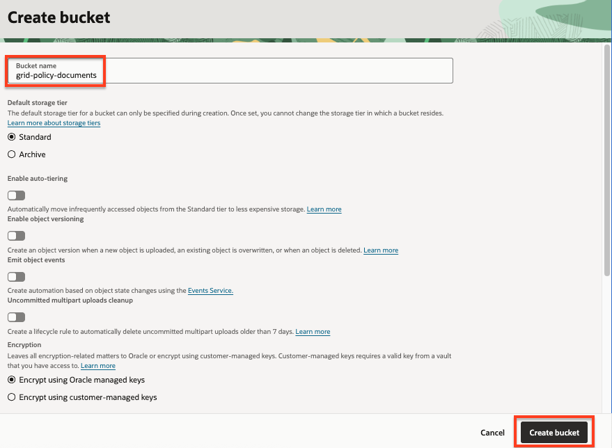

8. Click the newly created **grid-policy-documents** bucket from the Buckets list.

   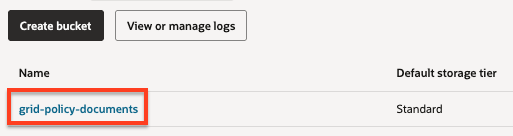

9. At this point, we will prepare the grid interconnection policy documents to be uploaded to the storage bucket.

10. [Click here to download the grid policy documents zip file](files/grid_policy_documents.zip).

    On a Mac:
    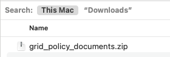       
    
    On Windows:
    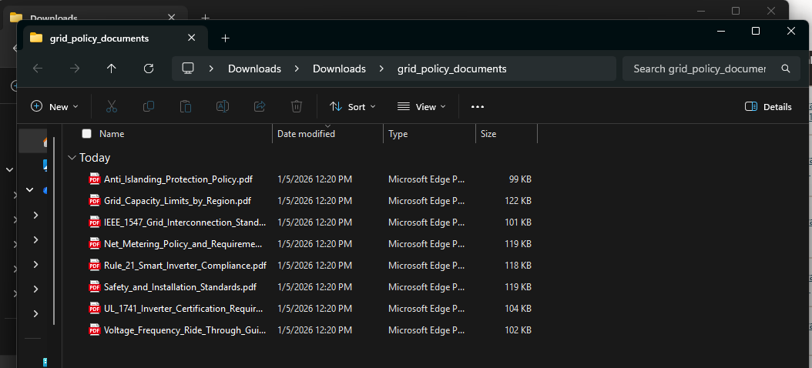

11. Unzip the file — you should have multiple PDF files representing different grid interconnection standards and policies (e.g., IEEE 1547 Standards, UL 1741 Certification, Anti-Islanding Policy, Grid Capacity Limits, etc.).

    If running this lab on a Mac, double click the zip file to unzip it.
    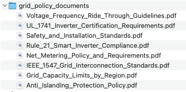

    If running this lab on a Windows machine, right click the zip file to extract all and choose a destination to save all files too.
    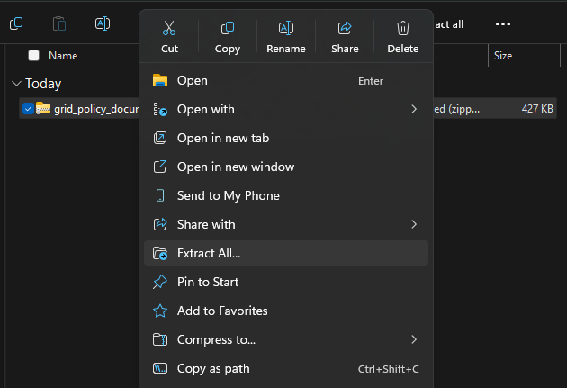
    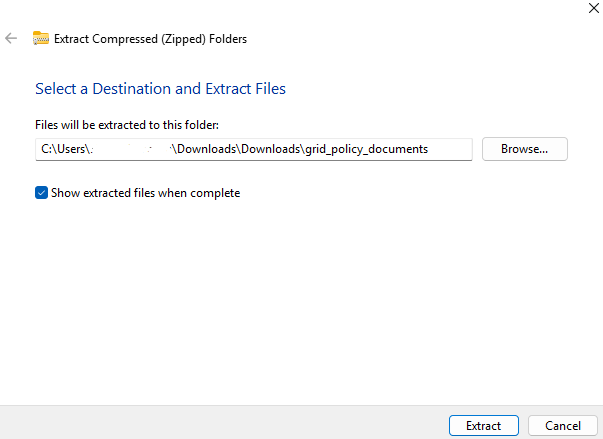

12. Click the **Upload** button on the top left of the Objects table or on the top right of the bucket details page.

    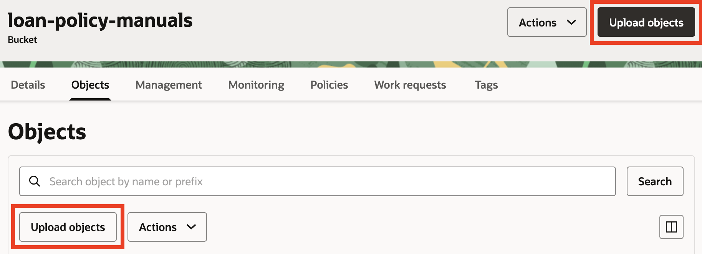

13. Click the **select files** link under the Choose Files from your Computer section.

    

14. Navigate to the location in which you have unzipped the grid policy documents (typically the Download folder) and select all 8 of the grid policy documents. The files may have been saved under a subfolder named `grid_policy_documents` or a similar name. After all files have been selected, click **Open** button.

    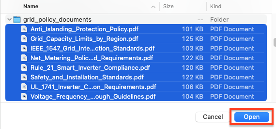

15. Click the **Upload** button to start the upload process.

    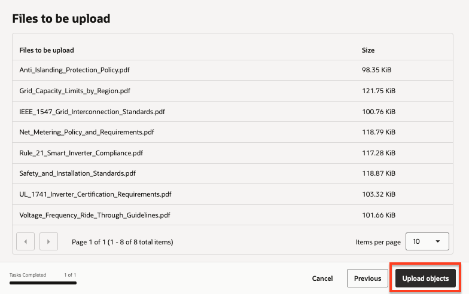

16. Once all of the files have **Finished** showing next to them, click the **Close** button.

    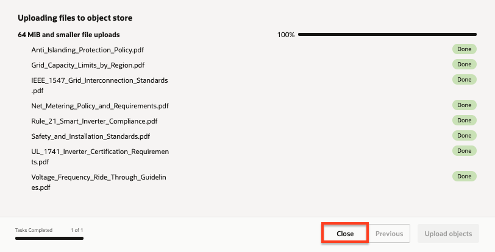

17. At this point you should see all 8 of the grid policy documents listed under the Objects table.

    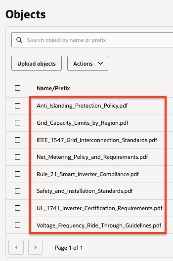

You may now proceed to the next lab.

## Learn More

- [Region subscription](https://docs.oracle.com/en-us/iaas/Content/Identity/Tasks/managingregions.htm)
- [Managing Dynamic Groups](https://docs.oracle.com/en-us/iaas/Content/Identity/Tasks/managingdynamicgroups.htm)
- [Getting Access to Generative AI Agents](https://docs.oracle.com/en-us/iaas/Content/generative-ai-agents/iam-policies.htm)

## Acknowledgements

- **Author** - Anthony Marino
- **Contributors** - Eli Schilling, Uma Kumar
