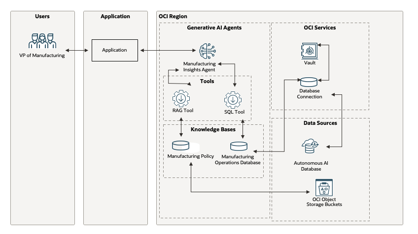

# Overview and Highlights

OCI Generative AI Agents is a fully managed service that combines the power of large language models (LLMs) with AI technologies to create intelligent virtual agents that can provide personalized, context-aware, and highly engaging experiences for enterprise decision-making.

## Key Features

* **Simple agent setup**: A fully managed, few-step setup process to create and deploy the agents.
* **Tools orchestration**: Orchestrate several tools and services to address complex workflows and automate conversations.
* **Multi-turn chat experience**: Engage in dynamic, multi-turn dialogues with more human-like interactions.
* **Context retention**: Ask follow-up questions because agents remember conversation context across turns for personalized and consistent interactions.
* **Custom instructions**: Guide the agent's behavior with added instructions.
* **Guardrails**: Have the agent help identify and apply content moderation, and help identify and protect against prompt injection (PI) and personally identifiable information (PII) at its endpoints.
* **Human-in-the-loop**: Optional feature for real-time monitoring and human intervention.
* **Scalability and security**: Get OCI's inherent secure and scalable infrastructure.

In OCI Generative AI Agents, depending on the use case, you can empower each agent with one or more of the following tools:

* **SQL Tool**: Converts natural language queries into SQL statements, which can automatically execute to generate responses against a connected database.
* **RAG Tool**: Retrieves information from one or more knowledge bases and aims to respond with relevant and context-aware information in natural language.
* **Custom Function Calling Tool**: Calls functions that you define to expand the features that the agent covers. The agent can execute the configured function and respond depending on the returned values.

## About this Workshop

In this workshop you will learn how to harness the power of conversational generative AI to unlock the information hidden in your documents and databases to automate business processes and increase productivity.

As a use case for this workshop, we are going to create a **Manufacturing Insights Agent**. This assistant, powered by an intelligent agent, will simplify the work of the VP of Manufacturing by searching and analyzing information from multiple data sources seamlessly and returning relevant information in human-readable form.

The agent enables executives to analyze procurement trends, identify supplier risks, evaluate exception patterns, review quality incidents, and uncover spending anomalies — all through natural language conversation.

**Estimated Workshop Time**: 1 hour 20 minutes

## Solution Architecture

The following is a simplified solution architecture diagram for our Manufacturing Insights Agent:

As described in the diagram, our solution makes use of the following resources:

### Autonomous AI Database

In this database, we are going to save information about the following entities relevant to our manufacturing procurement and operations system:

| Table | Purpose |
|-------|---------|
| **Suppliers** | Vendor directory with quality ratings, risk scores, and contract status |
| **Parts** | Part catalog with supplier linkage and pricing |
| **Facilities** | Manufacturing facilities for regional analysis |
| **Purchase_Orders** | PO records with approval status, amounts, and exceptions |
| **PO_Exceptions** | Standardized exception reason codes |
| **Quality_Incidents** | Supplier quality issues and delivery failures |

### Database Schema

[IMAGE]

### Storage Bucket

The storage bucket will store procurement and manufacturing policy documents (provided for you as part of this workshop). The agent will retrieve the relevant policy documents whenever a VP of Manufacturing requires this information.

The policy documents include:

| Policy Document | Description |
|-----------------|-------------|
| Supplier_Quality_Standards.pdf | Quality rating criteria, risk scoring methodology |
| PO_Exception_Approval_Policy.pdf | Exception types, approval thresholds, escalation paths |
| Pricing_Variance_Thresholds.pdf | Acceptable variance limits by category |
| Expedite_Request_Procedures.pdf | Expedite justification, cost allocation |
| Supplier_Probation_Procedures.pdf | Triggers, process, exit criteria |
| Sole_Source_Justification_Policy.pdf | Documentation requirements, risk mitigation |
| Production_Impact_Escalation_Policy.pdf | Escalation triggers, response timelines |
| Spend_Compliance_Standards.pdf | Budget adherence, approval limits by role |

### Additional Resources

* **Vault** - In this vault, we are going to securely store the credentials required to access the Autonomous AI Database instance.
* **Database Connection** - This resource will contain all of the information required to retrieve data from our Autonomous AI Database instance. The connection will securely retrieve the required credentials from the vault.
* **Knowledge Bases** - The two knowledge bases reference our two data sources, the Storage Bucket and the Autonomous AI Database instance, and are used by the relevant agent tools.
* **RAG Tool** - This tool is used by the agent to retrieve, reason over and analyze information from unstructured data such as the procurement policies stored in the storage bucket. The agent will use this tool whenever specific policy knowledge is required to complete a task.
* **SQL Tool** - This tool is used by the agent to retrieve, reason over and respond using information found in our Autonomous AI Database instance. This tool knows how to convert natural language requests or questions into SQL and can retrieve the information for the agent to use in its replies.
* **Agent** - The agent will receive all requests from the user, come up with an execution plan, will ask clarifying questions if required and route requests to the tools if needed. The agent will collect all of the pieces of information collected during the execution of the plan and compile a coherent response for the user.

In order to accelerate the development process, in this workshop we are going to use the chat feature built into the OCI console to communicate with the agent without writing or deploying a single line of code.

## Objectives

In this workshop, you will learn how to:

* Validate your tenancy for compatibility with the service and set up access policies.
* Set up our knowledge base data source.
* Create our Autonomous AI Database instance with all of the required data and configuration.
* Create the agent and supporting resources to make our solution come alive.
* As a VP of Manufacturing, have a conversation with our agent and see how it can supercharge your productivity.

## Learn More

* [OCI Generative AI Agents service information](https://www.oracle.com/artificial-intelligence/generative-ai/agents/)
* [OCI Generative AI Agents service documentation](https://docs.oracle.com/iaas/Content/gen-ai-agents/home.htm)
* [Managing SQL Tools in Generative AI Agents](https://docs.oracle.com/iaas/Content/gen-ai-agents/sql-tool.htm)
* [Managing RAG Tools in Generative AI Agents](https://docs.oracle.com/iaas/Content/gen-ai-agents/rag-tool.htm)
* [Managing Function Calling Tools in Generative AI Agents](https://docs.oracle.com/iaas/Content/gen-ai-agents/function-tool.htm)

## Acknowledgements

* **Author** - Taylor Zheng
* **Contributors** - Anthony Marino