# Lab 2: Setup the Database

## Introduction

In this lab, we are going to create an Autonomous AI Database, define the schema for suppliers, parts, facilities, purchase orders, and quality incidents, and insert seed data that the Manufacturing Insights Agent will query.

**Estimated Time**: 25 minutes

## Objectives

In this lab, you will:

* Create an Autonomous AI Database instance.
* Create the database schema.
* Insert data into the database.
* Create a vault to securely store the database connection information.
* Create a database connection.

## Prerequisites

This lab assumes you have:

* Completed the previous labs.

---

## Task 1: Create an Autonomous AI Database instance

In this task we are going to create a new Autonomous AI Database instance.

1. Click the navigation menu on the top left.
2. Click **Oracle Database**.
3. Click **Autonomous AI Database**.

   

4. Under the List scope section, make sure that the **root compartment** is selected.
5. Click the **Create Autonomous AI Database** button at the top of the Autonomous AI Databases table.

   

6. For the **Display name** use: `mfg-operations`
      ```text
      <copy>
      mfg-operations
      </copy>
      ```
7. For the **Database name** use: `mfgoperations`
      ```text
      <copy>
      mfgoperations
      </copy>
      ```
8. Under the **Compartment**, make sure that the root compartment is selected.
9. Under **Workload type** make sure that **Lakehouse** is selected.

   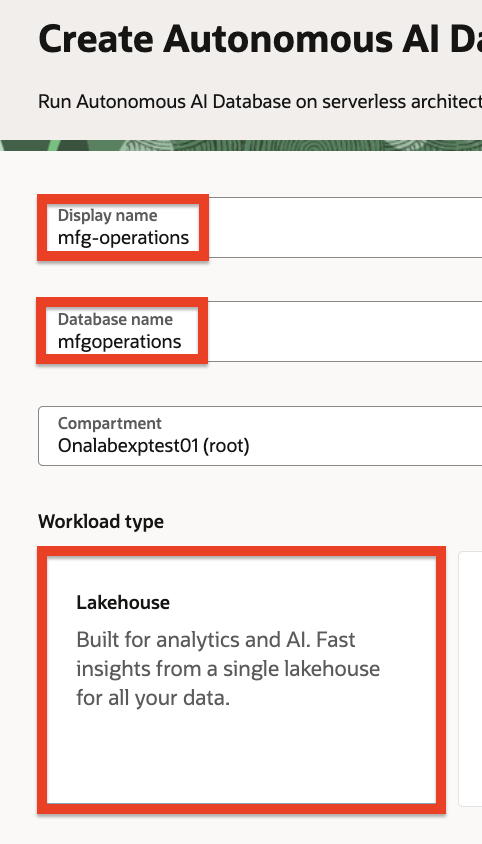
   
10. Under the **Database configuration** section, enable the **Developer** option.
11. Select **26ai** as the version under Choose database version.

   

12. Under the **Administrator credentials creation** section, type a password (for example: `myPassword123`), in the Password field and confirm the password in the Confirm password field. Please make sure to choose a password you'd remember as we are going to need to type this password later.

      ```text
      <copy>
      myPassword123
      </copy>
      ```

13. Under the **Network access** section, make sure that the **Secure access from everywhere** option is selected.

   

14. Click the **Create** button at the bottom of the screen.

Once the database instance is created, you can move on to the next task (this may take a few minutes).

---

## Task 2: Create the database schema

In this task we are going to use SQL scripts to create the database schema which consists of tables and sequences for our manufacturing procurement system.

1. Once the Autonomous AI Database instance is created, click the **Database actions** drop down and select the **SQL** option. This should launch a new tab in your browser with the SQL application (dismiss any messages if you see any).

   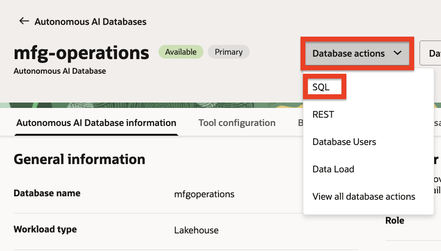

2. Copy the following SQL statements, paste them into the SQL worksheet and click the green **Run Script** button at the top.

      ```sql
      <copy>
      -- Create Suppliers table
      CREATE TABLE Suppliers (
         SupplierID           NUMBER PRIMARY KEY,
         SupplierName         VARCHAR2(100) NOT NULL,
         ContactEmail         VARCHAR2(100),
         ContactPhone         VARCHAR2(20),
         Region               VARCHAR2(50),
         QualityRating        NUMBER(2,1),
         RiskScore            NUMBER(3,0),
         ContractStatus       VARCHAR2(20),
         TotalSpend           NUMBER(12,2) DEFAULT 0,
         LastReviewDate       DATE
      );

      -- Create Parts table
      CREATE TABLE Parts (
         PartID               NUMBER PRIMARY KEY,
         PartNumber           VARCHAR2(30) UNIQUE NOT NULL,
         PartName             VARCHAR2(100) NOT NULL,
         Category             VARCHAR2(50),
         SupplierID           NUMBER NOT NULL,
         UnitCost             NUMBER(10,2),
         LeadTimeDays         NUMBER(3,0),
         SafetyStockQty       NUMBER(6,0),
         LastPriceUpdate      DATE,
         CONSTRAINT fk_part_supplier FOREIGN KEY (SupplierID) REFERENCES Suppliers(SupplierID)
      );

      -- Create Facilities table
      CREATE TABLE Facilities (
         FacilityID           NUMBER PRIMARY KEY,
         FacilityName         VARCHAR2(100) NOT NULL,
         City                 VARCHAR2(50),
         State                VARCHAR2(2),
         Region               VARCHAR2(50),
         FacilityType         VARCHAR2(30)
      );

      -- Create PO_Exceptions table
      CREATE TABLE PO_Exceptions (
         ExceptionID          NUMBER PRIMARY KEY,
         ExceptionCode        VARCHAR2(20) NOT NULL,
         ExceptionDescription VARCHAR2(100) NOT NULL,
         ExceptionCategory    VARCHAR2(50)
      );

      -- Create Purchase_Orders table
      CREATE TABLE Purchase_Orders (
         POID                 NUMBER PRIMARY KEY,
         PONumber             VARCHAR2(20) UNIQUE NOT NULL,
         PartID               NUMBER NOT NULL,
         FacilityID           NUMBER NOT NULL,
         SupplierID           NUMBER NOT NULL,
         OrderDate            DATE NOT NULL,
         Quantity             NUMBER(8,0),
         UnitPrice            NUMBER(10,2),
         TotalAmount          NUMBER(12,2),
         Status               VARCHAR2(20),
         ApproverID           VARCHAR2(20),
         ExceptionID          NUMBER,
         ApprovalDate         DATE,
         CONSTRAINT fk_po_part FOREIGN KEY (PartID) REFERENCES Parts(PartID),
         CONSTRAINT fk_po_facility FOREIGN KEY (FacilityID) REFERENCES Facilities(FacilityID),
         CONSTRAINT fk_po_supplier FOREIGN KEY (SupplierID) REFERENCES Suppliers(SupplierID),
         CONSTRAINT fk_po_exception FOREIGN KEY (ExceptionID) REFERENCES PO_Exceptions(ExceptionID)
      );

      -- Create Quality_Incidents table
      CREATE TABLE Quality_Incidents (
         IncidentID           NUMBER PRIMARY KEY,
         IncidentNumber       VARCHAR2(20) UNIQUE NOT NULL,
         SupplierID           NUMBER NOT NULL,
         PartID               NUMBER NOT NULL,
         FacilityID           NUMBER NOT NULL,
         IncidentDate         DATE NOT NULL,
         IncidentType         VARCHAR2(50),
         Severity             VARCHAR2(20),
         Description          VARCHAR2(500),
         RootCause            VARCHAR2(200),
         CorrectiveAction     VARCHAR2(200),
         Status               VARCHAR2(20),
         ProductionImpactHours NUMBER(5,1) DEFAULT 0,
         CONSTRAINT fk_qi_supplier FOREIGN KEY (SupplierID) REFERENCES Suppliers(SupplierID),
         CONSTRAINT fk_qi_part FOREIGN KEY (PartID) REFERENCES Parts(PartID),
         CONSTRAINT fk_qi_facility FOREIGN KEY (FacilityID) REFERENCES Facilities(FacilityID)
      );

      -- Create Sequences
      CREATE SEQUENCE supplier_seq START WITH 100 INCREMENT BY 1;
      CREATE SEQUENCE part_seq START WITH 1000 INCREMENT BY 1;
      CREATE SEQUENCE facility_seq START WITH 1 INCREMENT BY 1;
      CREATE SEQUENCE exception_seq START WITH 1 INCREMENT BY 1;
      CREATE SEQUENCE po_seq START WITH 5000 INCREMENT BY 1;
      CREATE SEQUENCE incident_seq START WITH 8000 INCREMENT BY 1;
      </copy>
      ```
   

You should see an output similar to the following:

```
Table SUPPLIERS created.
Table PARTS created.
Table FACILITIES created.
Table PO_EXCEPTIONS created.
Table PURCHASE_ORDERS created.
Table QUALITY_INCIDENTS created.
Sequence SUPPLIER_SEQ created.
Sequence PART_SEQ created.
Sequence FACILITY_SEQ created.
Sequence EXCEPTION_SEQ created.
Sequence PO_SEQ created.
Sequence INCIDENT_SEQ created.
```
   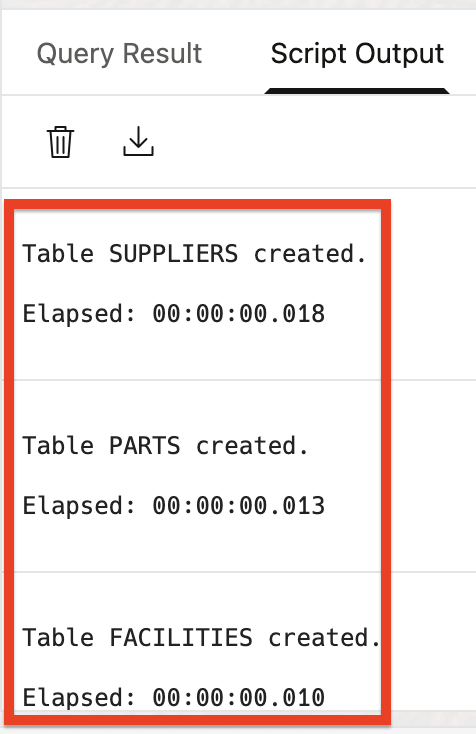
   
---

## Task 3: Insert data

In this task we are going to fill the database tables with data. One after the other, copy each of the following SQL sections, in order, and paste each statement into the SQL worksheet, replacing any existing text. After the statement has been pasted, click the **Run Script** button.

   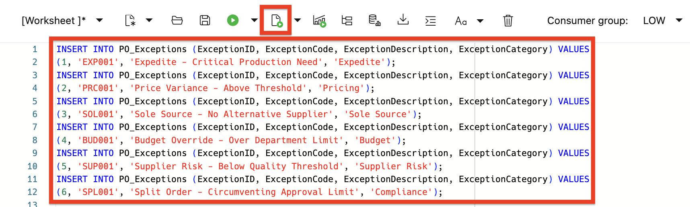

> **Important**: It is important to make sure that you only copy & execute a single section at a time. Don't forget to select all of the text in the worksheet before executing the statement.

   


### 1. Insert data into the PO_Exceptions table:

   ```sql
   <copy>
   INSERT INTO PO_Exceptions (ExceptionID, ExceptionCode, ExceptionDescription, ExceptionCategory) VALUES
   (1, 'EXP001', 'Expedite - Critical Production Need', 'Expedite');
   INSERT INTO PO_Exceptions (ExceptionID, ExceptionCode, ExceptionDescription, ExceptionCategory) VALUES
   (2, 'PRC001', 'Price Variance - Above Threshold', 'Pricing');
   INSERT INTO PO_Exceptions (ExceptionID, ExceptionCode, ExceptionDescription, ExceptionCategory) VALUES
   (3, 'SOL001', 'Sole Source - No Alternative Supplier', 'Sole Source');
   INSERT INTO PO_Exceptions (ExceptionID, ExceptionCode, ExceptionDescription, ExceptionCategory) VALUES
   (4, 'BUD001', 'Budget Override - Over Department Limit', 'Budget');
   INSERT INTO PO_Exceptions (ExceptionID, ExceptionCode, ExceptionDescription, ExceptionCategory) VALUES
   (5, 'SUP001', 'Supplier Risk - Below Quality Threshold', 'Supplier Risk');
   INSERT INTO PO_Exceptions (ExceptionID, ExceptionCode, ExceptionDescription, ExceptionCategory) VALUES
   (6, 'SPL001', 'Split Order - Circumventing Approval Limit', 'Compliance');

   COMMIT;
   </copy>
   ```

### 2. Insert data into the Suppliers table:

   ```sql
   <copy>
   INSERT INTO Suppliers (SupplierID, SupplierName, ContactEmail, ContactPhone, Region, QualityRating, RiskScore, ContractStatus, TotalSpend, LastReviewDate) VALUES
   (100, 'Precision Components Inc', 'sales@precisioncomp.com', '555-0100', 'Midwest', 4.5, 15, 'Active', 2450000.00, DATE '2025-06-15');
   INSERT INTO Suppliers (SupplierID, SupplierName, ContactEmail, ContactPhone, Region, QualityRating, RiskScore, ContractStatus, TotalSpend, LastReviewDate) VALUES
   (101, 'TechParts Global', 'orders@techparts.com', '555-0101', 'West', 4.2, 22, 'Active', 1875000.00, DATE '2025-05-20');
   INSERT INTO Suppliers (SupplierID, SupplierName, ContactEmail, ContactPhone, Region, QualityRating, RiskScore, ContractStatus, TotalSpend, LastReviewDate) VALUES
   (102, 'ValueMetal Manufacturing', 'vendor@valuemetal.com', '555-0102', 'Southeast', 2.4, 78, 'Probation', 980000.00, DATE '2025-08-01');
   INSERT INTO Suppliers (SupplierID, SupplierName, ContactEmail, ContactPhone, Region, QualityRating, RiskScore, ContractStatus, TotalSpend, LastReviewDate) VALUES
   (103, 'Industrial Supply Co', 'contact@industrialsupply.com', '555-0103', 'Northeast', 3.9, 28, 'Active', 1250000.00, DATE '2025-04-10');
   INSERT INTO Suppliers (SupplierID, SupplierName, ContactEmail, ContactPhone, Region, QualityRating, RiskScore, ContractStatus, TotalSpend, LastReviewDate) VALUES
   (104, 'QuickShip Components', 'sales@quickshipcomp.com', '555-0104', 'Southwest', 3.2, 45, 'Under Review', 720000.00, DATE '2025-07-22');
   INSERT INTO Suppliers (SupplierID, SupplierName, ContactEmail, ContactPhone, Region, QualityRating, RiskScore, ContractStatus, TotalSpend, LastReviewDate) VALUES
   (105, 'Reliable Metals Ltd', 'orders@reliablemetals.com', '555-0105', 'Midwest', 4.6, 12, 'Active', 3200000.00, DATE '2025-03-18');
   INSERT INTO Suppliers (SupplierID, SupplierName, ContactEmail, ContactPhone, Region, QualityRating, RiskScore, ContractStatus, TotalSpend, LastReviewDate) VALUES
   (106, 'Budget Parts Direct', 'info@budgetparts.com', '555-0106', 'West', 2.1, 85, 'Probation', 450000.00, DATE '2025-08-15');
   INSERT INTO Suppliers (SupplierID, SupplierName, ContactEmail, ContactPhone, Region, QualityRating, RiskScore, ContractStatus, TotalSpend, LastReviewDate) VALUES
   (107, 'Apex Machining Group', 'vendor@apexmach.com', '555-0107', 'Northeast', 4.0, 20, 'Active', 1680000.00, DATE '2025-05-05');

   COMMIT;
   </copy>
   ```

### 3. Insert data into the Facilities table:

   ```sql
   <copy>
   -- Disable substitution variables
   SET DEFINE OFF;

   INSERT INTO Facilities (FacilityID, FacilityName, City, State, Region, FacilityType) VALUES
   (1, 'Detroit Assembly Plant', 'Detroit', 'MI', 'Midwest', 'Assembly Plant');
   INSERT INTO Facilities (FacilityID, FacilityName, City, State, Region, FacilityType) VALUES
   (2, 'Chicago Assembly Plant', 'Chicago', 'IL', 'Midwest', 'Assembly Plant');
   INSERT INTO Facilities (FacilityID, FacilityName, City, State, Region, FacilityType) VALUES
   (3, 'Atlanta Distribution Center', 'Atlanta', 'GA', 'Southeast', 'Distribution Center');
   INSERT INTO Facilities (FacilityID, FacilityName, City, State, Region, FacilityType) VALUES
   (4, 'Dallas Assembly Plant', 'Dallas', 'TX', 'Southwest', 'Assembly Plant');
   INSERT INTO Facilities (FacilityID, FacilityName, City, State, Region, FacilityType) VALUES
   (5, 'Phoenix Component Plant', 'Phoenix', 'AZ', 'Southwest', 'Component Plant');
   INSERT INTO Facilities (FacilityID, FacilityName, City, State, Region, FacilityType) VALUES
   (6, 'Los Angeles Assembly Plant', 'Los Angeles', 'CA', 'West', 'Assembly Plant');
   INSERT INTO Facilities (FacilityID, FacilityName, City, State, Region, FacilityType) VALUES
   (7, 'Seattle R&D Center', 'Seattle', 'WA', 'West', 'R&D Center');
   INSERT INTO Facilities (FacilityID, FacilityName, City, State, Region, FacilityType) VALUES
   (8, 'Boston Component Plant', 'Boston', 'MA', 'Northeast', 'Component Plant');
   INSERT INTO Facilities (FacilityID, FacilityName, City, State, Region, FacilityType) VALUES
   (9, 'Newark Distribution Center', 'Newark', 'NJ', 'Northeast', 'Distribution Center');
   INSERT INTO Facilities (FacilityID, FacilityName, City, State, Region, FacilityType) VALUES
   (10, 'Miami Assembly Plant', 'Miami', 'FL', 'Southeast', 'Assembly Plant');

   COMMIT;
   </copy>
   ```

### 4. Insert data into the Parts table:

   ```sql
   <copy>
   -- Disable substitution variables
   SET DEFINE OFF;

   INSERT INTO Parts (PartID, PartNumber, PartName, Category, SupplierID, UnitCost, LeadTimeDays, SafetyStockQty, LastPriceUpdate) VALUES
   (1001, 'MTL-STL-001', 'Steel Alloy Sheet 4x8', 'Raw Materials', 105, 245.00, 14, 500, DATE '2025-06-01');
   INSERT INTO Parts (PartID, PartNumber, PartName, Category, SupplierID, UnitCost, LeadTimeDays, SafetyStockQty, LastPriceUpdate) VALUES
   (1002, 'MTL-ALU-002', 'Aluminum Extrusion Bar', 'Raw Materials', 105, 128.50, 10, 750, DATE '2025-05-15');
   INSERT INTO Parts (PartID, PartNumber, PartName, Category, SupplierID, UnitCost, LeadTimeDays, SafetyStockQty, LastPriceUpdate) VALUES
   (1003, 'CMP-BRG-001', 'Precision Ball Bearing', 'Components', 100, 45.00, 7, 2000, DATE '2025-04-20');
   INSERT INTO Parts (PartID, PartNumber, PartName, Category, SupplierID, UnitCost, LeadTimeDays, SafetyStockQty, LastPriceUpdate) VALUES
   (1004, 'CMP-MTR-002', 'Servo Motor Assembly', 'Components', 101, 385.00, 21, 150, DATE '2025-06-10');
   INSERT INTO Parts (PartID, PartNumber, PartName, Category, SupplierID, UnitCost, LeadTimeDays, SafetyStockQty, LastPriceUpdate) VALUES
   (1005, 'ELC-SNS-001', 'Proximity Sensor', 'Electronics', 101, 78.00, 14, 500, DATE '2025-05-25');
   INSERT INTO Parts (PartID, PartNumber, PartName, Category, SupplierID, UnitCost, LeadTimeDays, SafetyStockQty, LastPriceUpdate) VALUES
   (1006, 'ELC-CTL-002', 'PLC Controller Module', 'Electronics', 106, 520.00, 28, 50, DATE '2025-07-01');
   INSERT INTO Parts (PartID, PartNumber, PartName, Category, SupplierID, UnitCost, LeadTimeDays, SafetyStockQty, LastPriceUpdate) VALUES
   (1007, 'FST-BLT-001', 'Industrial Grade Bolt Set', 'Fasteners', 102, 12.50, 5, 5000, DATE '2025-03-15');
   INSERT INTO Parts (PartID, PartNumber, PartName, Category, SupplierID, UnitCost, LeadTimeDays, SafetyStockQty, LastPriceUpdate) VALUES
   (1008, 'FST-NUT-002', 'Lock Nut Assortment', 'Fasteners', 102, 8.75, 5, 8000, DATE '2025-03-15');
   INSERT INTO Parts (PartID, PartNumber, PartName, Category, SupplierID, UnitCost, LeadTimeDays, SafetyStockQty, LastPriceUpdate) VALUES
   (1009, 'HYD-PMP-001', 'Hydraulic Pump Unit', 'Hydraulics', 103, 1250.00, 35, 25, DATE '2025-04-01');
   INSERT INTO Parts (PartID, PartNumber, PartName, Category, SupplierID, UnitCost, LeadTimeDays, SafetyStockQty, LastPriceUpdate) VALUES
   (1010, 'HYD-VLV-002', 'Pressure Control Valve', 'Hydraulics', 103, 320.00, 21, 100, DATE '2025-04-15');
   INSERT INTO Parts (PartID, PartNumber, PartName, Category, SupplierID, UnitCost, LeadTimeDays, SafetyStockQty, LastPriceUpdate) VALUES
   (1011, 'PNU-CYL-001', 'Pneumatic Cylinder', 'Pneumatics', 104, 185.00, 14, 200, DATE '2025-05-01');
   INSERT INTO Parts (PartID, PartNumber, PartName, Category, SupplierID, UnitCost, LeadTimeDays, SafetyStockQty, LastPriceUpdate) VALUES
   (1012, 'PNU-FTG-002', 'Quick Connect Fitting Kit', 'Pneumatics', 104, 42.00, 7, 1000, DATE '2025-05-10');
   INSERT INTO Parts (PartID, PartNumber, PartName, Category, SupplierID, UnitCost, LeadTimeDays, SafetyStockQty, LastPriceUpdate) VALUES
   (1013, 'ASM-GBX-001', 'Gearbox Assembly', 'Assemblies', 107, 890.00, 28, 40, DATE '2025-06-20');
   INSERT INTO Parts (PartID, PartNumber, PartName, Category, SupplierID, UnitCost, LeadTimeDays, SafetyStockQty, LastPriceUpdate) VALUES
   (1014, 'ASM-DRV-002', 'Drive Train Module', 'Assemblies', 107, 1450.00, 35, 30, DATE '2025-06-25');
   INSERT INTO Parts (PartID, PartNumber, PartName, Category, SupplierID, UnitCost, LeadTimeDays, SafetyStockQty, LastPriceUpdate) VALUES
   (1015, 'ELC-WRG-003', 'Wiring Harness Complete', 'Electronics', 106, 165.00, 14, 300, DATE '2025-07-05');

   COMMIT;
   </copy>
   ```

### 5. Insert data into the Purchase_Orders table:

   ```sql
   <copy>
   -- POs with Expedite exceptions (from Southwest - pattern)
   INSERT INTO Purchase_Orders (POID, PONumber, PartID, FacilityID, SupplierID, OrderDate, Quantity, UnitPrice, TotalAmount, Status, ApproverID, ExceptionID, ApprovalDate) VALUES
   (5001, 'PO-2025-0001', 1004, 4, 101, DATE '2025-07-10', 50, 392.70, 19635.00, 'Approved', 'MGR001', 1, DATE '2025-07-10');
   INSERT INTO Purchase_Orders (POID, PONumber, PartID, FacilityID, SupplierID, OrderDate, Quantity, UnitPrice, TotalAmount, Status, ApproverID, ExceptionID, ApprovalDate) VALUES
   (5002, 'PO-2025-0002', 1011, 5, 104, DATE '2025-07-12', 100, 192.40, 19240.00, 'Approved', 'MGR001', 1, DATE '2025-07-12');
   INSERT INTO Purchase_Orders (POID, PONumber, PartID, FacilityID, SupplierID, OrderDate, Quantity, UnitPrice, TotalAmount, Status, ApproverID, ExceptionID, ApprovalDate) VALUES
   (5003, 'PO-2025-0003', 1009, 4, 103, DATE '2025-07-15', 10, 1312.50, 13125.00, 'Approved', 'MGR002', 1, DATE '2025-07-15');

   -- POs with Price Variance exceptions
   INSERT INTO Purchase_Orders (POID, PONumber, PartID, FacilityID, SupplierID, OrderDate, Quantity, UnitPrice, TotalAmount, Status, ApproverID, ExceptionID, ApprovalDate) VALUES
   (5004, 'PO-2025-0004', 1001, 1, 105, DATE '2025-07-18', 200, 281.75, 56350.00, 'Approved', 'MGR002', 2, DATE '2025-07-19');
   INSERT INTO Purchase_Orders (POID, PONumber, PartID, FacilityID, SupplierID, OrderDate, Quantity, UnitPrice, TotalAmount, Status, ApproverID, ExceptionID, ApprovalDate) VALUES
   (5005, 'PO-2025-0005', 1006, 6, 106, DATE '2025-07-20', 25, 598.00, 14950.00, 'Approved', 'MGR001', 2, DATE '2025-07-21');

   -- POs with Sole Source exceptions (high-value parts)
   INSERT INTO Purchase_Orders (POID, PONumber, PartID, FacilityID, SupplierID, OrderDate, Quantity, UnitPrice, TotalAmount, Status, ApproverID, ExceptionID, ApprovalDate) VALUES
   (5006, 'PO-2025-0006', 1014, 1, 107, DATE '2025-07-22', 15, 1450.00, 21750.00, 'Approved', 'DIR001', 3, DATE '2025-07-23');
   INSERT INTO Purchase_Orders (POID, PONumber, PartID, FacilityID, SupplierID, OrderDate, Quantity, UnitPrice, TotalAmount, Status, ApproverID, ExceptionID, ApprovalDate) VALUES
   (5007, 'PO-2025-0007', 1013, 2, 107, DATE '2025-07-25', 20, 890.00, 17800.00, 'Approved', 'MGR002', 3, DATE '2025-07-26');

   -- POs with Budget Override exceptions
   INSERT INTO Purchase_Orders (POID, PONumber, PartID, FacilityID, SupplierID, OrderDate, Quantity, UnitPrice, TotalAmount, Status, ApproverID, ExceptionID, ApprovalDate) VALUES
   (5008, 'PO-2025-0008', 1001, 2, 105, DATE '2025-07-28', 500, 245.00, 122500.00, 'Approved', 'DIR001', 4, DATE '2025-07-29');
   INSERT INTO Purchase_Orders (POID, PONumber, PartID, FacilityID, SupplierID, OrderDate, Quantity, UnitPrice, TotalAmount, Status, ApproverID, ExceptionID, ApprovalDate) VALUES
   (5009, 'PO-2025-0009', 1009, 1, 103, DATE '2025-08-01', 30, 1250.00, 37500.00, 'Pending', 'DIR001', 4, NULL);

   -- POs with Supplier Risk exceptions (from probation suppliers)
   INSERT INTO Purchase_Orders (POID, PONumber, PartID, FacilityID, SupplierID, OrderDate, Quantity, UnitPrice, TotalAmount, Status, ApproverID, ExceptionID, ApprovalDate) VALUES
   (5010, 'PO-2025-0010', 1007, 3, 102, DATE '2025-08-02', 2000, 12.50, 25000.00, 'Approved', 'MGR001', 5, DATE '2025-08-03');
   INSERT INTO Purchase_Orders (POID, PONumber, PartID, FacilityID, SupplierID, OrderDate, Quantity, UnitPrice, TotalAmount, Status, ApproverID, ExceptionID, ApprovalDate) VALUES
   (5011, 'PO-2025-0011', 1008, 10, 102, DATE '2025-08-04', 3000, 8.75, 26250.00, 'Approved', 'MGR002', 5, DATE '2025-08-05');
   INSERT INTO Purchase_Orders (POID, PONumber, PartID, FacilityID, SupplierID, OrderDate, Quantity, UnitPrice, TotalAmount, Status, ApproverID, ExceptionID, ApprovalDate) VALUES
   (5012, 'PO-2025-0012', 1006, 8, 106, DATE '2025-08-06', 15, 520.00, 7800.00, 'Denied', NULL, 5, NULL);

   -- Normal POs (no exceptions)
   INSERT INTO Purchase_Orders (POID, PONumber, PartID, FacilityID, SupplierID, OrderDate, Quantity, UnitPrice, TotalAmount, Status, ApproverID, ExceptionID, ApprovalDate) VALUES
   (5013, 'PO-2025-0013', 1003, 1, 100, DATE '2025-07-08', 500, 45.00, 22500.00, 'Approved', 'MGR001', NULL, DATE '2025-07-08');
   INSERT INTO Purchase_Orders (POID, PONumber, PartID, FacilityID, SupplierID, OrderDate, Quantity, UnitPrice, TotalAmount, Status, ApproverID, ExceptionID, ApprovalDate) VALUES
   (5014, 'PO-2025-0014', 1002, 2, 105, DATE '2025-07-11', 300, 128.50, 38550.00, 'Approved', 'MGR001', NULL, DATE '2025-07-11');
   INSERT INTO Purchase_Orders (POID, PONumber, PartID, FacilityID, SupplierID, OrderDate, Quantity, UnitPrice, TotalAmount, Status, ApproverID, ExceptionID, ApprovalDate) VALUES
   (5015, 'PO-2025-0015', 1005, 6, 101, DATE '2025-07-14', 200, 78.00, 15600.00, 'Approved', 'MGR002', NULL, DATE '2025-07-14');
   INSERT INTO Purchase_Orders (POID, PONumber, PartID, FacilityID, SupplierID, OrderDate, Quantity, UnitPrice, TotalAmount, Status, ApproverID, ExceptionID, ApprovalDate) VALUES
   (5016, 'PO-2025-0016', 1010, 4, 103, DATE '2025-07-17', 50, 320.00, 16000.00, 'Approved', 'MGR001', NULL, DATE '2025-07-17');
   INSERT INTO Purchase_Orders (POID, PONumber, PartID, FacilityID, SupplierID, OrderDate, Quantity, UnitPrice, TotalAmount, Status, ApproverID, ExceptionID, ApprovalDate) VALUES
   (5017, 'PO-2025-0017', 1012, 5, 104, DATE '2025-07-19', 400, 42.00, 16800.00, 'Approved', 'MGR001', NULL, DATE '2025-07-19');
   INSERT INTO Purchase_Orders (POID, PONumber, PartID, FacilityID, SupplierID, OrderDate, Quantity, UnitPrice, TotalAmount, Status, ApproverID, ExceptionID, ApprovalDate) VALUES
   (5018, 'PO-2025-0018', 1003, 8, 100, DATE '2025-07-23', 1000, 45.00, 45000.00, 'Approved', 'MGR002', NULL, DATE '2025-07-23');
   INSERT INTO Purchase_Orders (POID, PONumber, PartID, FacilityID, SupplierID, OrderDate, Quantity, UnitPrice, TotalAmount, Status, ApproverID, ExceptionID, ApprovalDate) VALUES
   (5019, 'PO-2025-0019', 1015, 9, 106, DATE '2025-07-26', 100, 165.00, 16500.00, 'Approved', 'MGR001', NULL, DATE '2025-07-26');
   INSERT INTO Purchase_Orders (POID, PONumber, PartID, FacilityID, SupplierID, OrderDate, Quantity, UnitPrice, TotalAmount, Status, ApproverID, ExceptionID, ApprovalDate) VALUES
   (5020, 'PO-2025-0020', 1004, 7, 101, DATE '2025-07-29', 25, 385.00, 9625.00, 'Approved', 'MGR002', NULL, DATE '2025-07-29');
   INSERT INTO Purchase_Orders (POID, PONumber, PartID, FacilityID, SupplierID, OrderDate, Quantity, UnitPrice, TotalAmount, Status, ApproverID, ExceptionID, ApprovalDate) VALUES
   (5021, 'PO-2025-0021', 1011, 3, 104, DATE '2025-08-01', 75, 185.00, 13875.00, 'Approved', 'MGR001', NULL, DATE '2025-08-01');
   INSERT INTO Purchase_Orders (POID, PONumber, PartID, FacilityID, SupplierID, OrderDate, Quantity, UnitPrice, TotalAmount, Status, ApproverID, ExceptionID, ApprovalDate) VALUES
   (5022, 'PO-2025-0022', 1002, 10, 105, DATE '2025-08-03', 150, 128.50, 19275.00, 'Approved', 'MGR002', NULL, DATE '2025-08-03');
   INSERT INTO Purchase_Orders (POID, PONumber, PartID, FacilityID, SupplierID, OrderDate, Quantity, UnitPrice, TotalAmount, Status, ApproverID, ExceptionID, ApprovalDate) VALUES
   (5023, 'PO-2025-0023', 1007, 1, 102, DATE '2025-08-05', 1000, 12.50, 12500.00, 'Pending', 'MGR001', NULL, NULL);
   INSERT INTO Purchase_Orders (POID, PONumber, PartID, FacilityID, SupplierID, OrderDate, Quantity, UnitPrice, TotalAmount, Status, ApproverID, ExceptionID, ApprovalDate) VALUES
   (5024, 'PO-2025-0024', 1005, 2, 101, DATE '2025-08-07', 300, 78.00, 23400.00, 'Pending', 'MGR002', NULL, NULL);
   INSERT INTO Purchase_Orders (POID, PONumber, PartID, FacilityID, SupplierID, OrderDate, Quantity, UnitPrice, TotalAmount, Status, ApproverID, ExceptionID, ApprovalDate) VALUES
   (5025, 'PO-2025-0025', 1010, 6, 103, DATE '2025-08-09', 80, 320.00, 25600.00, 'Pending', 'MGR001', NULL, NULL);

   COMMIT;
   </copy>
   ```

### 6. Insert data into the Quality_Incidents table:

   ```sql
   <copy>
   -- Incidents from ValueMetal Manufacturing (Probation supplier - high incident pattern)
   INSERT INTO Quality_Incidents (IncidentID, IncidentNumber, SupplierID, PartID, FacilityID, IncidentDate, IncidentType, Severity, Description, RootCause, CorrectiveAction, Status, ProductionImpactHours) VALUES
   (8001, 'QI-2025-0001', 102, 1007, 1, DATE '2025-06-15', 'Dimensional Defect', 'Critical', 'Bolt threads out of spec causing assembly failures', 'Worn tooling at supplier', 'Tooling replacement and inspection protocol', 'Closed', 12.5);
   INSERT INTO Quality_Incidents (IncidentID, IncidentNumber, SupplierID, PartID, FacilityID, IncidentDate, IncidentType, Severity, Description, RootCause, CorrectiveAction, Status, ProductionImpactHours) VALUES
   (8002, 'QI-2025-0002', 102, 1008, 3, DATE '2025-06-22', 'Material Defect', 'Major', 'Lock nuts failing torque requirements', 'Incorrect heat treatment', 'Process audit and certification', 'Closed', 8.0);
   INSERT INTO Quality_Incidents (IncidentID, IncidentNumber, SupplierID, PartID, FacilityID, IncidentDate, IncidentType, Severity, Description, RootCause, CorrectiveAction, Status, ProductionImpactHours) VALUES
   (8003, 'QI-2025-0003', 102, 1007, 2, DATE '2025-07-05', 'Dimensional Defect', 'Critical', 'Batch of bolts with incorrect head dimensions', 'Calibration drift', 'Daily calibration checks implemented', 'Closed', 16.0);
   INSERT INTO Quality_Incidents (IncidentID, IncidentNumber, SupplierID, PartID, FacilityID, IncidentDate, IncidentType, Severity, Description, RootCause, CorrectiveAction, Status, ProductionImpactHours) VALUES
   (8004, 'QI-2025-0004', 102, 1008, 10, DATE '2025-07-18', 'Documentation', 'Minor', 'Missing certification documents for fastener lot', 'Administrative error', 'Document control training', 'Closed', 2.0);
   INSERT INTO Quality_Incidents (IncidentID, IncidentNumber, SupplierID, PartID, FacilityID, IncidentDate, IncidentType, Severity, Description, RootCause, CorrectiveAction, Status, ProductionImpactHours) VALUES
   (8005, 'QI-2025-0005', 102, 1007, 4, DATE '2025-08-02', 'Material Defect', 'Major', 'Corrosion found on bolt shipment', 'Improper storage at supplier', 'Storage protocol revision', 'Open', 6.0);

   -- Incidents from Budget Parts Direct (Probation supplier)
   INSERT INTO Quality_Incidents (IncidentID, IncidentNumber, SupplierID, PartID, FacilityID, IncidentDate, IncidentType, Severity, Description, RootCause, CorrectiveAction, Status, ProductionImpactHours) VALUES
   (8006, 'QI-2025-0006', 106, 1006, 6, DATE '2025-06-28', 'Functional Defect', 'Critical', 'PLC modules failing during burn-in test', 'Component sourcing issue', 'Supplier component audit', 'Closed', 24.0);
   INSERT INTO Quality_Incidents (IncidentID, IncidentNumber, SupplierID, PartID, FacilityID, IncidentDate, IncidentType, Severity, Description, RootCause, CorrectiveAction, Status, ProductionImpactHours) VALUES
   (8007, 'QI-2025-0007', 106, 1015, 8, DATE '2025-07-10', 'Workmanship', 'Major', 'Wiring harness connectors poorly crimped', 'Training gap', 'Operator recertification', 'Closed', 10.0);
   INSERT INTO Quality_Incidents (IncidentID, IncidentNumber, SupplierID, PartID, FacilityID, IncidentDate, IncidentType, Severity, Description, RootCause, CorrectiveAction, Status, ProductionImpactHours) VALUES
   (8008, 'QI-2025-0008', 106, 1006, 1, DATE '2025-07-25', 'Functional Defect', 'Critical', 'PLC communication failures in production', 'Firmware version mismatch', 'Version control procedure', 'Closed', 18.0);
   INSERT INTO Quality_Incidents (IncidentID, IncidentNumber, SupplierID, PartID, FacilityID, IncidentDate, IncidentType, Severity, Description, RootCause, CorrectiveAction, Status, ProductionImpactHours) VALUES
   (8009, 'QI-2025-0009', 106, 1015, 9, DATE '2025-08-05', 'Workmanship', 'Major', 'Wire gauge incorrect in harness assembly', 'Drawing revision not implemented', 'Engineering change control', 'Open', 8.0);

   -- Incidents from QuickShip Components (Under Review supplier)
   INSERT INTO Quality_Incidents (IncidentID, IncidentNumber, SupplierID, PartID, FacilityID, IncidentDate, IncidentType, Severity, Description, RootCause, CorrectiveAction, Status, ProductionImpactHours) VALUES
   (8010, 'QI-2025-0010', 104, 1011, 5, DATE '2025-07-01', 'Delivery', 'Major', 'Pneumatic cylinders delivered 5 days late', 'Capacity constraints', 'Lead time buffer increase', 'Closed', 20.0);
   INSERT INTO Quality_Incidents (IncidentID, IncidentNumber, SupplierID, PartID, FacilityID, IncidentDate, IncidentType, Severity, Description, RootCause, CorrectiveAction, Status, ProductionImpactHours) VALUES
   (8011, 'QI-2025-0011', 104, 1012, 4, DATE '2025-07-14', 'Packaging', 'Minor', 'Fitting kits damaged due to inadequate packaging', 'Packaging specification change', 'Packaging review and update', 'Closed', 4.0);
   INSERT INTO Quality_Incidents (IncidentID, IncidentNumber, SupplierID, PartID, FacilityID, IncidentDate, IncidentType, Severity, Description, RootCause, CorrectiveAction, Status, ProductionImpactHours) VALUES
   (8012, 'QI-2025-0012', 104, 1011, 3, DATE '2025-07-28', 'Delivery', 'Major', 'Partial shipment received, balance delayed', 'Inventory management failure', 'Safety stock agreement', 'Open', 14.0);

   -- Normal incidents from good suppliers
   INSERT INTO Quality_Incidents (IncidentID, IncidentNumber, SupplierID, PartID, FacilityID, IncidentDate, IncidentType, Severity, Description, RootCause, CorrectiveAction, Status, ProductionImpactHours) VALUES
   (8013, 'QI-2025-0013', 100, 1003, 1, DATE '2025-06-20', 'Dimensional Defect', 'Minor', 'Bearing tolerance at upper limit', 'Normal process variation', 'Monitoring increased', 'Closed', 1.0);
   INSERT INTO Quality_Incidents (IncidentID, IncidentNumber, SupplierID, PartID, FacilityID, IncidentDate, IncidentType, Severity, Description, RootCause, CorrectiveAction, Status, ProductionImpactHours) VALUES
   (8014, 'QI-2025-0014', 101, 1004, 6, DATE '2025-07-08', 'Documentation', 'Minor', 'Test certificates delayed', 'Lab backlog', 'Priority processing agreed', 'Closed', 0.5);
   INSERT INTO Quality_Incidents (IncidentID, IncidentNumber, SupplierID, PartID, FacilityID, IncidentDate, IncidentType, Severity, Description, RootCause, CorrectiveAction, Status, ProductionImpactHours) VALUES
   (8015, 'QI-2025-0015', 103, 1009, 4, DATE '2025-07-20', 'Functional Defect', 'Minor', 'Hydraulic pump pressure slightly below spec', 'Seal wear', 'Warranty replacement', 'Closed', 3.0);
   INSERT INTO Quality_Incidents (IncidentID, IncidentNumber, SupplierID, PartID, FacilityID, IncidentDate, IncidentType, Severity, Description, RootCause, CorrectiveAction, Status, ProductionImpactHours) VALUES
   (8016, 'QI-2025-0016', 105, 1001, 2, DATE '2025-08-01', 'Packaging', 'Minor', 'Steel sheets with minor surface scratches', 'Handling during shipping', 'Protective film added', 'Closed', 2.0);
   INSERT INTO Quality_Incidents (IncidentID, IncidentNumber, SupplierID, PartID, FacilityID, IncidentDate, IncidentType, Severity, Description, RootCause, CorrectiveAction, Status, ProductionImpactHours) VALUES
   (8017, 'QI-2025-0017', 107, 1013, 1, DATE '2025-08-08', 'Documentation', 'Minor', 'Assembly instructions revision needed', 'Documentation lag', 'Concurrent engineering', 'Open', 1.5);

   COMMIT;
   </copy>
   ```

### 7. Run the verification query

Run the following verification query to confirm the data was inserted correctly:

   ```sql
   <copy>
   SELECT 'PO_Exceptions' AS TableName, COUNT(*) AS RecordCount FROM PO_Exceptions
   UNION ALL SELECT 'Suppliers', COUNT(*) FROM Suppliers
   UNION ALL SELECT 'Facilities', COUNT(*) FROM Facilities
   UNION ALL SELECT 'Parts', COUNT(*) FROM Parts
   UNION ALL SELECT 'Purchase_Orders', COUNT(*) FROM Purchase_Orders
   UNION ALL SELECT 'Quality_Incidents', COUNT(*) FROM Quality_Incidents;
   </copy>
   ```

You should see the following counts:

| Table | Record Count |
|-------|--------------|
| PO_Exceptions | 6 |
| Suppliers | 8 |
| Facilities | 10 |
| Parts | 15 |
| Purchase_Orders | 25 |
| Quality_Incidents | 17 |

---

## Task 4: Create a Vault to securely store the database connection information

In this task we are going to create a Vault and an encryption key. We are going to use this vault to securely store the password used to connect to the database as a secret.

1. Click the navigation menu on the top left.
2. Click **Identity & Security**.
3. Click **Vault** under Key Management & Secret Management.

   

4. Under the List scope section, make sure that the **root compartment** is selected.
5. Click the **Create Vault** button at the top of the Vaults table.

   

6. Under the Create in Compartment, make sure that the **root compartment** is selected.
7. For the **Name** field use: `mfg-operations-secrets`

   ```text
   <copy>
   mfg-operations-secrets
   </copy>
   ```

8. Click the **Create Vault** button at the bottom of the form.

   

9. Wait for the vault to be created.

   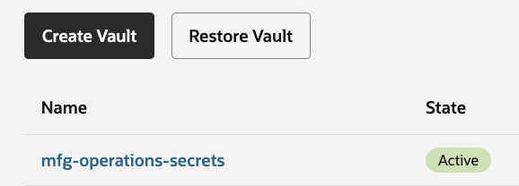

10. Once the vault is created, click its name from the Vaults list.
11. Under the List scope section, make sure that the **root compartment** is selected.
12. Click the **Create Key** button at the top of the Master Encryption Keys table.
   
13. Under the Create in Compartment, make sure that the **root compartment** is selected.
14. For the **Name** field use: `mfg-operations-key`
   ```text
   <copy>
   mfg-operations-key
   </copy>
   ```
15. Click the **Create Key** button.
   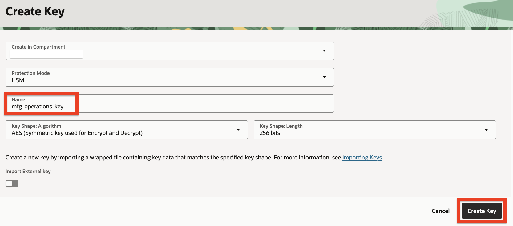

---

## Task 5: Create a database connection

In this section we are going to create a connection to our database. This connection is going to be used by the agent to retrieve information from the database.

1. Click the navigation menu on the top left.
2. Click **Developer Services**.
3. Click **Connections** under Database Tools.
   
4. Under the List scope section, make sure that the **root compartment** is selected.
5. Click the **Create Connection** button at the top of the Connections table.
   
6. For the **Name** field use: `mfg-operations`
      ```text
      <copy>
      mfg-operations
      </copy>
      ```
7. Under the **Compartment**, make sure that the root compartment is selected.
8. Make sure that the **Select database** option is selected under the Database details section.
9. In the **Database cloud service** drop-down, select **Oracle Autonomous AI Database**.
10. In the **Database in...** drop down, select the **mfg-operations** database.
11. In the **Username** field, type: `ADMIN`
   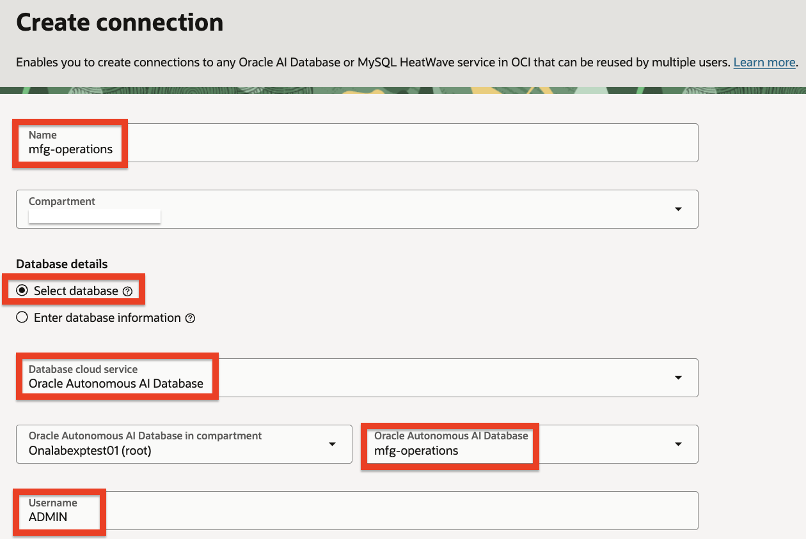
12. Under the **User password secret in...** drop-down, click the **Create password secret** button.
   
This step will create a secret which will be stored in the Vault created earlier and will contain the password for connecting to the database.

13. For the **Name** field use: `mfg-operations-admin-password`
      ```text
      <copy>
      mfg-operations-admin-password
      </copy>
      ```
14. Select the **mfg-operations-secrets** in the Vault in... drop-down.
15. Select the **mfg-operations-key** in the Encryption key in... drop-down.
16. In the **User password** field, type the password you've used when you created the Autonomous AI Database instance.
17. Do the same in the **Confirm user password** field.
18. Click the **Create** button.
   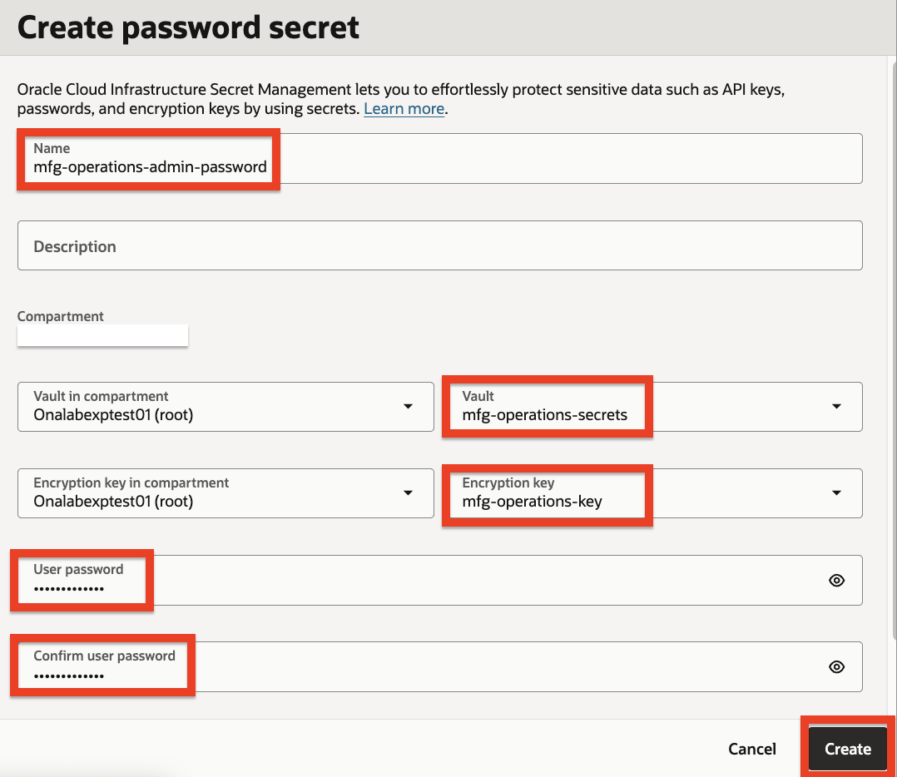
19. Back in the Create connection panel, the newly created password secret is automatically selected in the User password secret in... drop-down.
   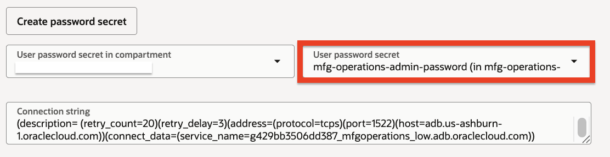
20. Under the **SSL details** section, click the **Create wallet content secret** button. This will create a secret which will help the agent securely communicate with the database.
   
21. For the **Name** field use: `mfg-operations-wallet-secret`
      ```text
      <copy>
      mfg-operations-wallet-secret
      </copy>
      ```
22. Select the **mfg-operations-secrets** in the Vault in... drop-down.
23. Select the **mfg-operations-key** in the Encryption key in... drop-down.
24. Under the **Wallet** section, select the **Retrieve regional wallet from Autonomous AI Database** option.
25. Click the **Create** button.
   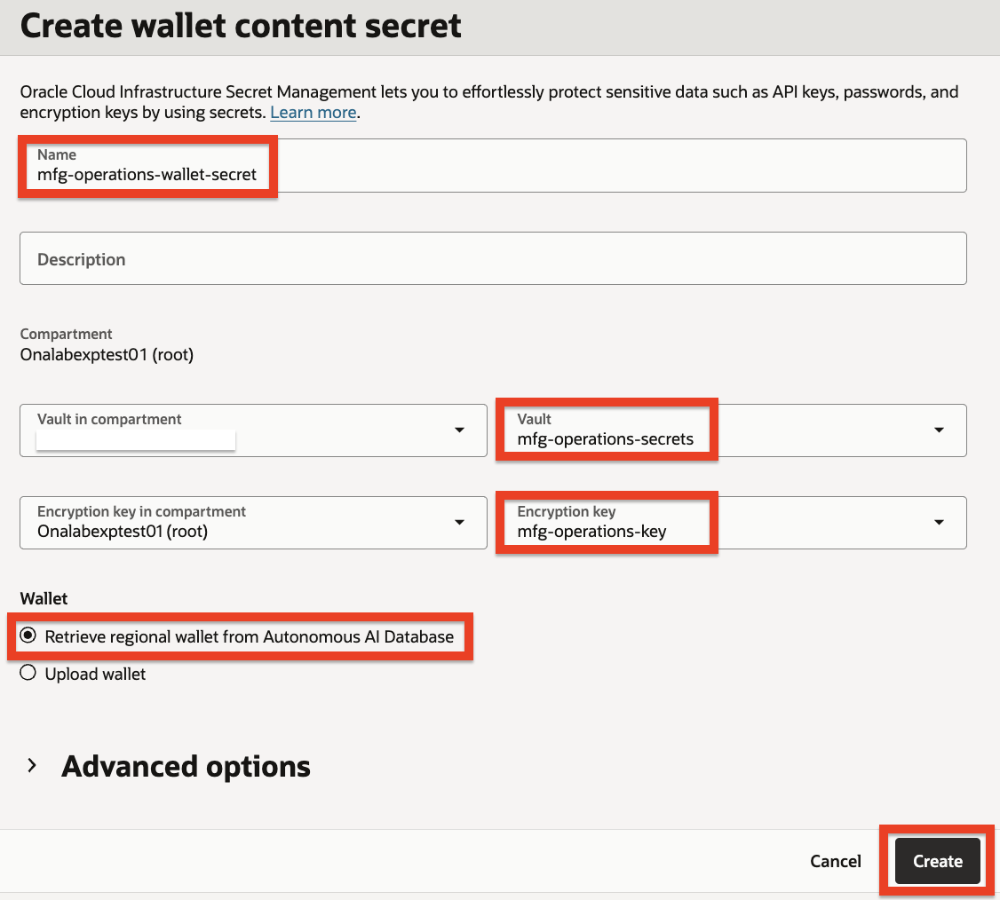
26. Back in the Create connection panel, the newly created wallet secret is automatically selected in the SSO wallet content secret in... drop-down.
27. Click the **Create** button.
   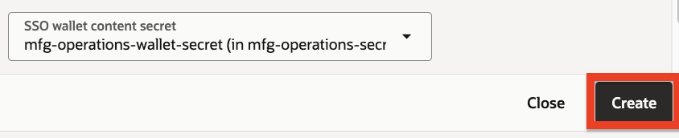

---

## Task 6: Validate the connection

In this task we are going to make sure that the connection was created successfully.

1. After the connection was created, click **Validate** button on the top right of the connection page.
   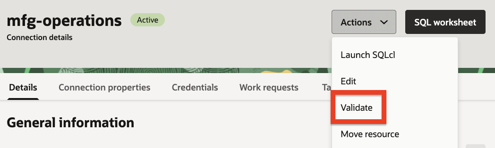
2. Click the **Validate** button at the bottom of the Validate connection dialog.
   
3. If everything was configured correctly, you should see a successful validation result.
   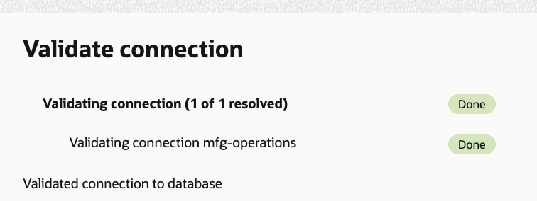
4. You can click the **Close** link to exit the dialog.
   
   
---

## Summary

You have successfully completed this lab. You have:

* Created an Autonomous AI Database instance
* Created the schema for suppliers, parts, facilities, purchase orders, and quality incidents
* Inserted seed data that mirrors real manufacturing procurement scenarios
* Created a vault and encryption key for secure credential storage
* Created and validated a database connection

**You may now proceed to the next lab.**

---

## Learn More

* [Provision an Autonomous AI Database Instance](https://docs.oracle.com/iaas/autonomous-database/doc/provision-autonomous-ai-database.html)
* [Connect with Built-In Oracle Database Actions](https://docs.oracle.com/iaas/autonomous-database/doc/connect-database-actions.html)
* [Creating a Vault](https://docs.oracle.com/iaas/Content/KeyManagement/Tasks/managingvaults.htm)
* [Creating a Master Encryption Key](https://docs.oracle.com/iaas/Content/KeyManagement/Tasks/managingkeys.htm)
* [Database Tools - Creating a Connection](https://docs.oracle.com/iaas/database-tools/doc/creating-connection.html)

## Acknowledgements

* **Author** - Taylor Zheng
* **Contributors** - Anthony Marino, Uma Kumar, Deion Locklear, Wynne Yang