# Lab 1: Create the Agent

## Introduction

In this lab we are going to create the intelligent agent which will drive our entire solution. We will provide the agent with the required tools and knowledge bases to perform its work effectively. Tools are resources the agent can use to perform its tasks. In our use-case, we are going to use two tools:

* **RAG Tool** - Which will scan the procurement policy documents uploaded to object storage whenever the user requires such information.
* **SQL Tool** - Which will be able to retrieve information stored in our database instance relating to suppliers, parts, purchase orders, facilities, and quality incidents.

**Estimated Time**: 15 minutes

## Objectives

In this lab, you will:

* Create our agent including the RAG & SQL Tools and assign the relevant knowledge base to each.

## Prerequisites

This lab assumes you have:

* All previous labs successfully completed.

---

## Task 1: Create the agent

1. In the OCI Console, click the **Region** selector in the top-right corner and switch to **US Midwest (Chicago)** for this workshop.
   
2. Click the navigation menu on the top left.
3. Click **Analytics & AI**.
4. Click **Generative AI Agents**.
   
5. In the overview page, click the **Agents** link.
6. Under the List scope section, make sure that your **compartment** is selected.
7. Click the **Create Agent** button at the top of the Agents table.
   
8. For the **Name** field use: `manufacturing insights agent`
9. For the **Compartment** field, make sure that your compartment is selected.
10. For the **Description** field, use:

```text
<copy>
This agent assists the VP of Manufacturing in analyzing procurement trends, identifying supplier risks, evaluating PO exception patterns, reviewing quality incidents, and uncovering spending anomalies to optimize manufacturing and supply chain decisions.
</copy>
```

11. For the **Welcome message** field, use:

```text
<copy>
Hello! I'm your Manufacturing Insights Assistant. I can help you analyze procurement trends, evaluate supplier performance and risk, identify PO exception patterns, review quality incidents, and answer questions about our manufacturing policies. Ask away!
</copy>
```

12. Click the **Next** button.

---

## Task 2: Add the RAG Tool

1. Under the Tools section, click the **Add tool** button to create our first tool.

   
2. Select the **RAG tool** option.
3. Under the RAG Configuration section, use `Manufacturing Policy Knowledge Base` in the **Name** field.
4. For the **Description** field, use:

   ```text
   <copy>
   Use this tool when users ask about policies, standards, thresholds, procedures, or compliance requirements. Retrieves manufacturing and procurement policies including: Supplier Quality Standards (ratings, risk scoring, performance criteria), PO Exception Approval Policy (exception types, thresholds, escalation paths), Pricing Variance Thresholds (acceptable limits by category, approval requirements), Expedite Request Procedures (justification requirements, cost allocation), Supplier Probation Procedures (triggers, process, exit criteria), Sole Source Justification Policy (documentation requirements, risk mitigation), Production Impact Escalation Policy (escalation triggers, response timelines), and Spend Compliance Standards (budget limits, approval authority levels).
   </copy>
   ```

> **Important**: It is very important to provide a high-level description of the knowledge that this tool can retrieve. This allows the agent to make accurate decisions when choosing to invoke this tool.

   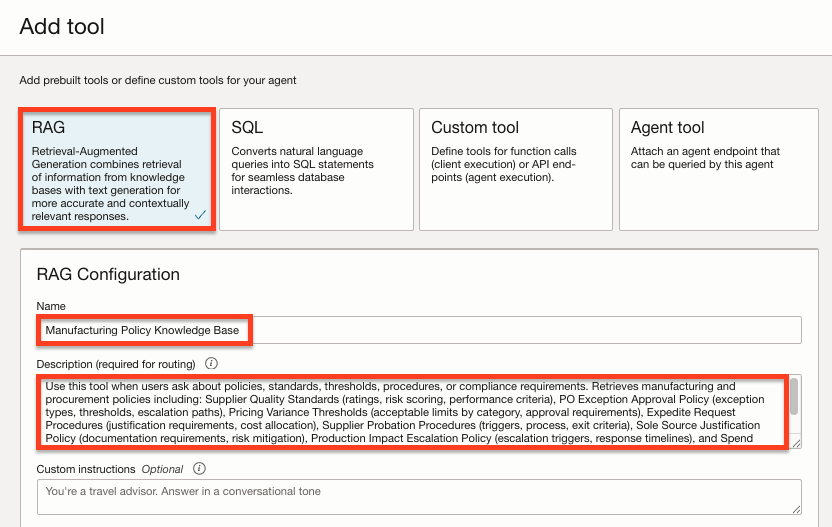

5. Under the **Add knowledge bases** section, make sure that your compartment is selected in the Compartment field.
   
6. Click the **Create knowledge base** button. In this step we are going to create a knowledge base which references the storage bucket into which we've uploaded the procurement policy documents.
   
   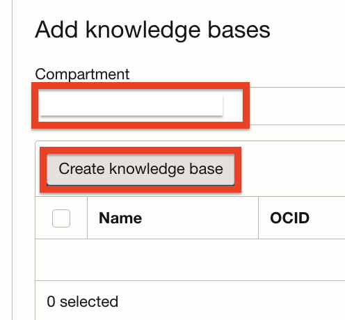

### Create the Knowledge Base

7. In the New knowledge base form, use: `Manufacturing Policy Documents` for the **Name** field.

   ```text
   <copy>
   Manufacturing Policy Documents
   </copy>
   ```

8. Make sure that your compartment is selected in the **Compartment** field.
9. In the **Data store type** field, we will select **Object storage** to be able to retrieve information from our storage bucket.
10. Make sure that **Enable hybrid search** is checked. Enabling this option instructs the system to combine lexical and semantic search when scanning our documents.
11. Click the **Specify data source** button.
   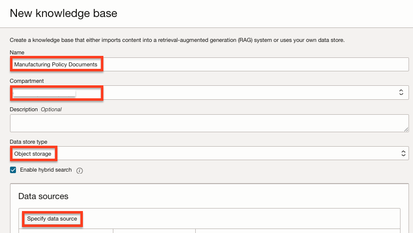
12. In the Specify data source form, use: `manufacturing policy docs` for the **Name** field.
   ```text
   <copy>
   manufacturing policy docs
   </copy>
   ```
13. Make sure that the **Enable multi-modal parsing** option is not checked. This option enables parsing of rich content, such as charts and graphics, to allow responses based on visual elements. However, we do not have any images in our policy documents so right now this option is not required.
14. Under the **Data bucket** option, select the `manufacturing-procurement-policies` bucket into which we've previously uploaded the policy PDF files.
15. Check the **Select all in bucket** option. This option will automatically flag all of the files in the bucket for ingestion instead of us having to select each file individually.
16. Click the **Create** button.
   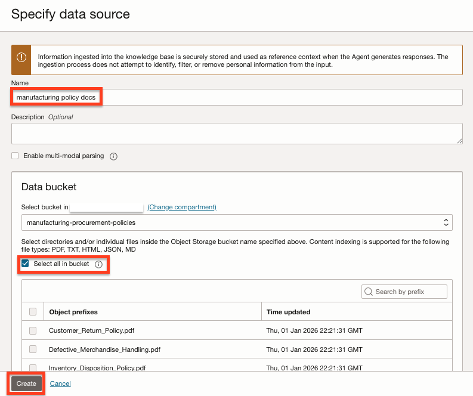
17. Back in the New knowledge base panel, the `manufacturing policy docs` data source was added to the Data source table.
18. Make sure that the **Automatically start ingestion job for above data sources** option is checked. This will create an ingestion job which will scan all of our files automatically when the knowledge base is initially created. Please note that this will only run the ingestion job once. In order to re-ingest information from the bucket in the future, you will need to trigger a job manually.
19. Click the **Create** button.
   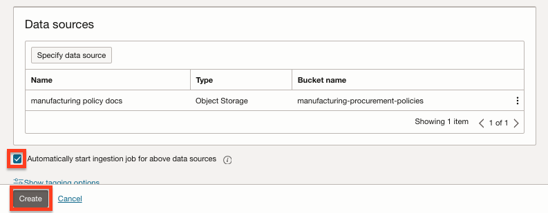
20. The knowledge base will take a few minutes to create and ingest the data. You may proceed to the next step while the knowledge base provisions.
21. Back at the Add knowledge bases panel, make sure that the checkbox next to the knowledge base name is checked.

> 💡 **Tip**: If your knowledge base does not appear ("No items found"), you can still continue to the next step. The knowledge base is already selected and provisioning in the background. You may open a new tab and navigate to Agents > Knowledge Bases to confirm it is provisioning.

22. Click the **Add tool** button.
   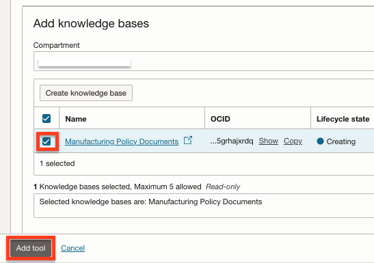

---

## Task 3: Add the SQL Tool

1. Now that we have our RAG tool configured, let's configure our SQL tool. In the Tools section Click the **Add tool** button.
   
2. Click the **SQL** option.
3. For the **Name** field, use: `Manufacturing Operations Database`

      ```text
      <copy>
      Manufacturing Operations Database
      </copy>
      ```

4. For the **Description** field, use:

      ```text
      <copy>
      Use this tool when users ask about suppliers, parts, purchase orders, facilities, quality incidents, exceptions, spending, or operational patterns. Contains database tables for: Suppliers (name, quality rating, risk score, contract status, total spend), Parts (part number, name, category, supplier, cost, lead time), Facilities (name, city, region, type), PO Exceptions (codes like EXP001, PRC001, SOL001 for expedites, price variances, sole source), Purchase Orders (part, facility, supplier, amount, status, exception, approver), and Quality Incidents (supplier, part, facility, type, severity, production impact hours, status).
      </copy>
      ```

    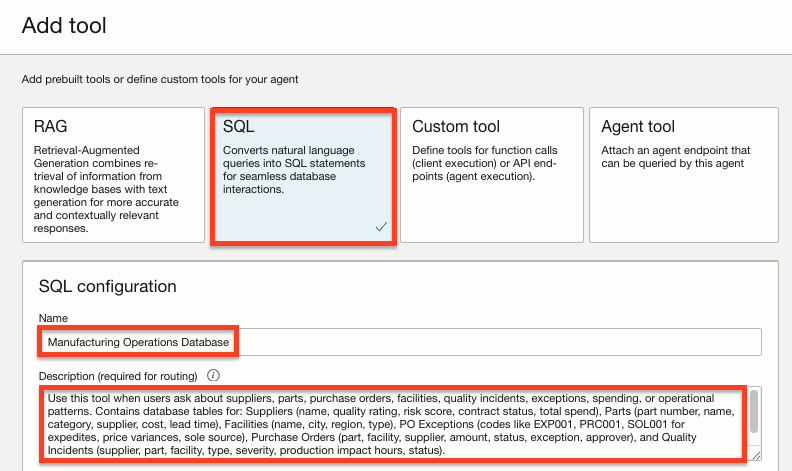

5. Under **Import database schema configuration for this tool**, select the **Inline** option which will allow us to use the same schema text we've used when we created the database.
6. Copy the following text and paste it into the **Database schema** field:

```sql
<copy>
CREATE TABLE Suppliers (
    SupplierID           NUMBER PRIMARY KEY,
    SupplierName         VARCHAR2(100) NOT NULL,
    ContactEmail         VARCHAR2(100),
    ContactPhone         VARCHAR2(20),
    Region               VARCHAR2(50),
    QualityRating        NUMBER(2,1),
    RiskScore            NUMBER(3,0),
    ContractStatus       VARCHAR2(20),
    TotalSpend           NUMBER(12,2) DEFAULT 0,
    LastReviewDate       DATE
);

CREATE TABLE Parts (
    PartID               NUMBER PRIMARY KEY,
    PartNumber           VARCHAR2(30) UNIQUE NOT NULL,
    PartName             VARCHAR2(100) NOT NULL,
    Category             VARCHAR2(50),
    SupplierID           NUMBER NOT NULL,
    UnitCost             NUMBER(10,2),
    LeadTimeDays         NUMBER(3,0),
    SafetyStockQty       NUMBER(6,0),
    LastPriceUpdate      DATE
);

CREATE TABLE Facilities (
    FacilityID           NUMBER PRIMARY KEY,
    FacilityName         VARCHAR2(100) NOT NULL,
    City                 VARCHAR2(50),
    State                VARCHAR2(2),
    Region               VARCHAR2(50),
    FacilityType         VARCHAR2(30)
);

CREATE TABLE PO_Exceptions (
    ExceptionID          NUMBER PRIMARY KEY,
    ExceptionCode        VARCHAR2(20) NOT NULL,
    ExceptionDescription VARCHAR2(100) NOT NULL,
    ExceptionCategory    VARCHAR2(50)
);

CREATE TABLE Purchase_Orders (
    POID                 NUMBER PRIMARY KEY,
    PONumber             VARCHAR2(20) UNIQUE NOT NULL,
    PartID               NUMBER NOT NULL,
    FacilityID           NUMBER NOT NULL,
    SupplierID           NUMBER NOT NULL,
    OrderDate            DATE NOT NULL,
    Quantity             NUMBER(8,0),
    UnitPrice            NUMBER(10,2),
    TotalAmount          NUMBER(12,2),
    Status               VARCHAR2(20),
    ApproverID           VARCHAR2(20),
    ExceptionID          NUMBER,
    ApprovalDate         DATE
);

CREATE TABLE Quality_Incidents (
    IncidentID           NUMBER PRIMARY KEY,
    IncidentNumber       VARCHAR2(20) UNIQUE NOT NULL,
    SupplierID           NUMBER NOT NULL,
    PartID               NUMBER NOT NULL,
    FacilityID           NUMBER NOT NULL,
    IncidentDate         DATE NOT NULL,
    IncidentType         VARCHAR2(50),
    Severity             VARCHAR2(20),
    Description          VARCHAR2(500),
    RootCause            VARCHAR2(200),
    CorrectiveAction     VARCHAR2(200),
    Status               VARCHAR2(20),
    ProductionImpactHours NUMBER(5,1) DEFAULT 0
);
</copy>
```

7. Under the **In-context learning examples**, leave the **None** option selected.
8. Under the **Description of tables and columns**, select the **Inline** option.
9. Copy and paste the following text into the **Description of tables and columns**. This verbal description contains details about each table and column. This will allow the tool to better understand the data stored in our database:

      ```text
      <copy>
      IMPORTANT JOIN PATHS:
         - To link POs to Suppliers: Purchase_Orders → Suppliers (via SupplierID)
         - To link POs to Parts: Purchase_Orders → Parts (via PartID)
         - To link POs to Facilities: Purchase_Orders → Facilities (via FacilityID)
         - To link POs to Exceptions: Purchase_Orders → PO_Exceptions (via ExceptionID) - NOTE: ExceptionID can be NULL for normal POs
         - To link Quality Incidents to Suppliers: Quality_Incidents → Suppliers (via SupplierID) - USE THIS TO GET SUPPLIER NAMES FOR INCIDENTS
         - To link Parts to Suppliers: Parts → Suppliers (via SupplierID)
         
      CRITICAL: Supplier names (like 'ValueMetal Manufacturing') are in the SUPPLIERS table, NOT in Facilities. 
         - Facilities contains plant/location names (like 'Detroit Assembly Plant')
         - Suppliers contains vendor/company names (like 'ValueMetal Manufacturing', 'Budget Parts Direct')
         - To get supplier name for a Quality_Incident: JOIN Quality_Incidents to Suppliers ON SupplierID
         
         - Exception-related POs have ExceptionID NOT NULL
         - Expedite exceptions have ExceptionCategory = 'Expedite' (code EXP001)
         - Price variance exceptions have ExceptionCategory = 'Pricing' (code PRC001)
         - Sole source exceptions have ExceptionCategory = 'Sole Source' (code SOL001)
         - Supplier risk exceptions have ExceptionCategory = 'Supplier Risk' (code SUP001)

         Suppliers — Vendor directory with quality and risk tracking.
            SupplierID (number): PK
            SupplierName (string): Company name
            ContactEmail, ContactPhone: Contact information
            Region (string): Geographic region (Midwest, West, Southeast, Northeast, Southwest)
            QualityRating (number): Quality score from 1.0 to 5.0 (higher is better)
            RiskScore (number): Risk score from 0 to 100 (lower is better, <25 = low risk, 25-50 = medium, >50 = high risk)
            ContractStatus (string): Active, Probation, Under Review, or Terminated
            TotalSpend (number): USE THIS FIELD for total dollars spent with this supplier (historical spend total)
            LastReviewDate (date): Date of most recent supplier review

         Parts — Part catalog. Each part is sourced from one supplier.
            PartID (number): PK
            PartNumber (string): Part number (e.g., MTL-STL-001, CMP-BRG-001)
            PartName (string): Part display name
            Category (string): Raw Materials, Components, Electronics, Fasteners, Hydraulics, Pneumatics, Assemblies
            SupplierID (number): FK → Suppliers.SupplierID (join Parts to Suppliers on this column)
            UnitCost (number): Standard cost per unit
            LeadTimeDays (number): Standard lead time in days
            SafetyStockQty (number): Safety stock quantity
            LastPriceUpdate (date): Date of last price change

         Facilities — Manufacturing facilities for regional analysis.
            FacilityID (number): PK
            FacilityName (string): Facility display name (e.g., Detroit Assembly Plant)
            City, State: Location
            Region (string): Northeast, Southeast, Midwest, Southwest, West
            FacilityType (string): Assembly Plant, Component Plant, Distribution Center, R&D Center

         PO_Exceptions — Standardized exception reason codes for purchase orders.
            ExceptionID (number): PK
            ExceptionCode (string): EXP001 (expedite), PRC001 (price variance), SOL001 (sole source), BUD001 (budget override), SUP001 (supplier risk), SPL001 (split order)
            ExceptionDescription (string): Human-readable description
            ExceptionCategory (string): Expedite, Pricing, Sole Source, Budget, Supplier Risk, Compliance

         Purchase_Orders — PO records with approval status and exceptions.
            POID (number): PK
            PONumber (string): Unique PO number (e.g., PO-2025-0001)
            PartID (number): FK → Parts.PartID
            FacilityID (number): FK → Facilities.FacilityID
            SupplierID (number): FK → Suppliers.SupplierID
            OrderDate (date): Date PO was created
            Quantity (number): Number of units ordered
            UnitPrice (number): Price per unit on this PO
            TotalAmount (number): Total PO value (Quantity * UnitPrice)
            Status (string): Approved, Pending, Denied
            ApproverID (string): ID of approver (MGR001, MGR002, DIR001 for director-level)
            ExceptionID (number): FK → PO_Exceptions.ExceptionID (NULL if no exception)
            ApprovalDate (date): Date approved (NULL if pending or denied)

         Quality_Incidents — Supplier quality issues and delivery failures.
            IncidentID (number): PK
            IncidentNumber (string): Unique incident number (e.g., QI-2025-0001)
            SupplierID (number): FK → Suppliers.SupplierID
            PartID (number): FK → Parts.PartID
            FacilityID (number): FK → Facilities.FacilityID
            IncidentDate (date): Date incident was reported
            IncidentType (string): Dimensional Defect, Material Defect, Functional Defect, Documentation, Delivery, Packaging, Workmanship
            Severity (string): Critical, Major, Minor
            Description (string): Detailed description of the incident
            RootCause (string): Identified root cause
            CorrectiveAction (string): Corrective action taken or planned
            Status (string): Open, Closed
            ProductionImpactHours (number): Hours of production lost due to this incident
      </copy>
      ```

      

10. For **Model customization**, select the **Small** option.
11. For **Dialect**, select **Oracle SQL**.
12. In the **Database tool connection**, select your compartment, then choose the `mfg-operations` connection we previously created.

> 💡 **Tip**: If your database tool connection does not appear in your compartment ("Option not available"), select Cancel and re-add the SQL tool by repeating Task 3: Add the SQL Tool.

13. Click the **Test connection** button. You should see a successful connection attempt.
14. Enable the **SQL execution** option. This option will instruct the tool to execute the SQL queries generated by the tool as a result of the user's requests. This will allow the agent to craft intelligent responses based on the data returned from the queries.
15. Enable the **Self correction** option. Enabling this option will allow the tool to automatically detect and correct syntax errors in generated SQL queries.
16. Click the **Add tool** button.
   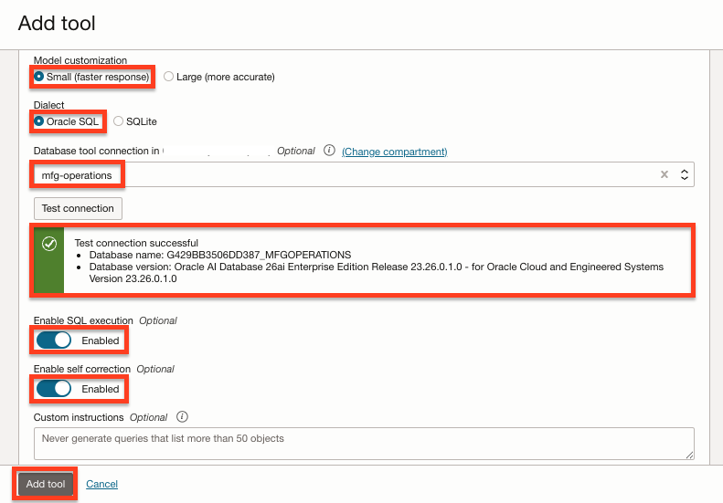
17. Back in the Tools section, Click **Next**.
    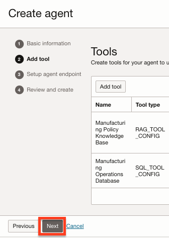
   
---

## Task 4: Setup the Agent Endpoint

1. In the Setup agent endpoint section, check the **Automatically create an endpoint for this agent**.
2. Enable the **Enable human in the loop** option. This will enable the agent to ask for additional human input or information if needed.
   
   
3. We are going to leave all of the options under **Guardrails** for Content moderation, Prompt injection (PI) protection & Personally identifiable information (PII) protection sections as **Disabled**. Those options are important but not required for our demonstration. Please refer to the Learn More section below for additional information about those options.
4. Click the **Next** button.

   
   
---

## Task 5: Review and Create

1. In the Review and create page, review the agent information and click the **Create agent** button.

   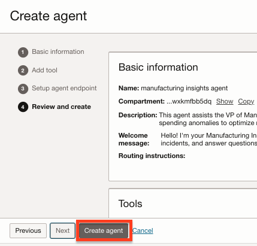
   
   
2. In the license agreement dialog, review the agreement, check the consent checkbox and click the **Submit** button.

   


3. The agent will take a few minutes to create. When complete, the agent's Lifecycle state will show **Active**.

   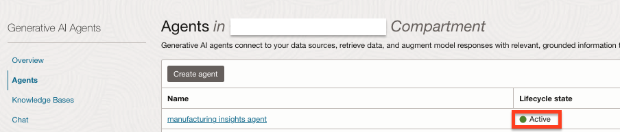

---

## Summary

You have successfully completed this lab. You have:

* Created the Manufacturing Insights Agent
* Configured the RAG tool with the procurement policy knowledge base
* Configured the SQL tool with the manufacturing database schema
* Set up the agent endpoint with human-in-the-loop enabled

**You may now proceed to the next lab.**

---

## Learn More

* [Creating an Agent in Generative AI Agents](https://docs.oracle.com/iaas/Content/gen-ai-agents/create-agent.htm)
* [Add AI Guardrails to OCI Generative AI Model Endpoints](https://docs.oracle.com/iaas/Content/gen-ai-agents/guardrails.htm)

## Acknowledgements

* **Author** - Taylor Zheng
* **Contributors** - Anthony Marino, Uma Kumar, Deion Locklear, Wynne Yang