# Lab 4: Test the Solution

## Introduction

Our provisioning work is now complete. It is now time to enjoy the fruits of our labor. In the previous labs we have:

* Created the proper permissions & basic setup.
* Uploaded the procurement policy documents to a storage bucket.
* Created our Autonomous AI Database instance and filled it with data.
* Created an agent as well as the SQL and RAG tools alongside their knowledge bases.
* Configured the agent endpoint.

It is now time for us to test our solution. As a **VP of Manufacturing**, you'll use the agent to analyze procurement trends, identify supplier risks, evaluate exception patterns, and get policy guidance.

**Estimated Time**: 15 minutes

## Objectives

In this lab, you will:

* Use the agent to answer questions about suppliers, purchase orders, quality incidents, and procurement policies.

## Prerequisites

This lab assumes you have:

* All previous labs successfully completed

> 💡 **Note**: Prior prompts and conversation history may influence responses and agent routing. If results are unexpected, rephrase your request or retry in a fresh session.

---

## Task 1: Overview of the chat page functionality

1. If the agent is still not showing as **Active**, give it a few more minutes to complete the provisioning process.
2. Once the agent is showing as Active, click the **manufacturing insights agent** in the Agents list.
    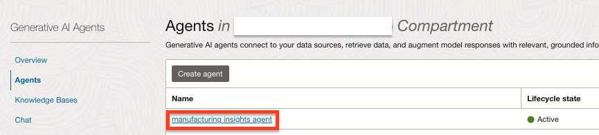
3. In the agent details page, click the **Launch chat** button.
    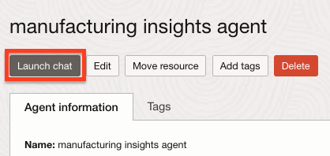
4. In the chat page, on the left, make sure that both the **Agent compartment** and the **Agent endpoint compartment** are set to your compartment.
5. On the top of the page, the **Agent** drop down should show `manufacturing insights agent` and the **Agent endpoint** drop down should show the newly created endpoint.
6. In the chat window, you'll be able to see the greeting message we have configured for the agent.
7. Other elements in the page include:
    * The message text box where you would write the messages for the agent.
    * The **Submit** and **Reset chat session** buttons, which you'll use to send the message you've typed in the message text box and reset all communications up until that point, respectively.
    * On the right, you'll see the **Traces** pane where the agent will communicate the various steps it took while reasoning over your requests.

    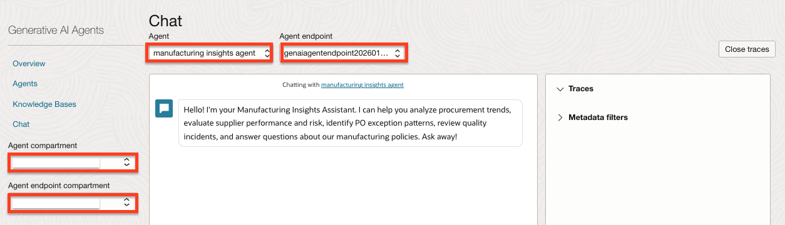

---

## Task 2: Let's test our agent

1. To start, type the following question into the message box:
   ```text
   <copy>
   Show me all purchase orders approved with exceptions. Group them by exception type.
   </copy>
   ```
2. Click the **Submit** button.
    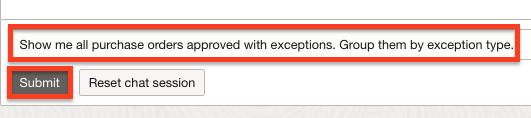
3. The agent generates a SQL query to find POs with exceptions. You should see results grouped by Expedite, Price Variance, Sole Source, Budget Override, and Supplier Risk exceptions. In addition, you can see that a trace was generated on the right.
4. Click the **View** button next to the first trace.
    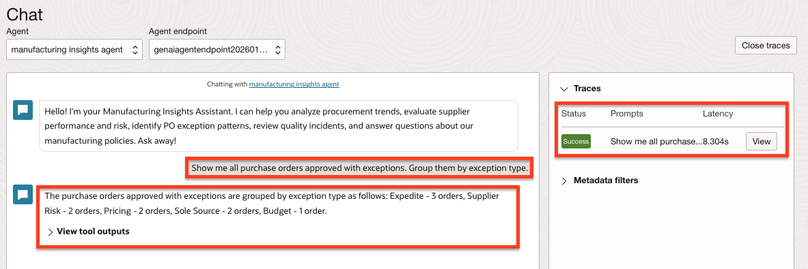
5. Expand the traces to see the full output (click the **Show more** link to see the rest of the output). The traces give you a glimpse of how the agent went about addressing your request. As you can see, the first trace shows how the agent is trying to figure out what the answer should be.
    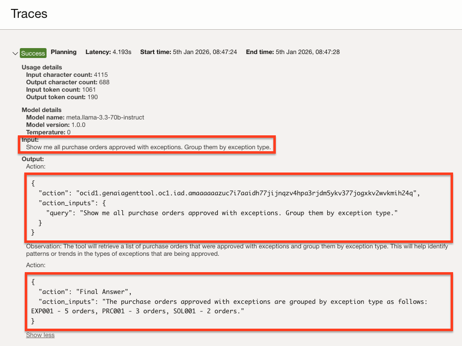
6. In the second trace, you'll be able to see that the agent invoked the SQL tool and generated a SQL request. This request will be executed and the response will be incorporated in the final response.
    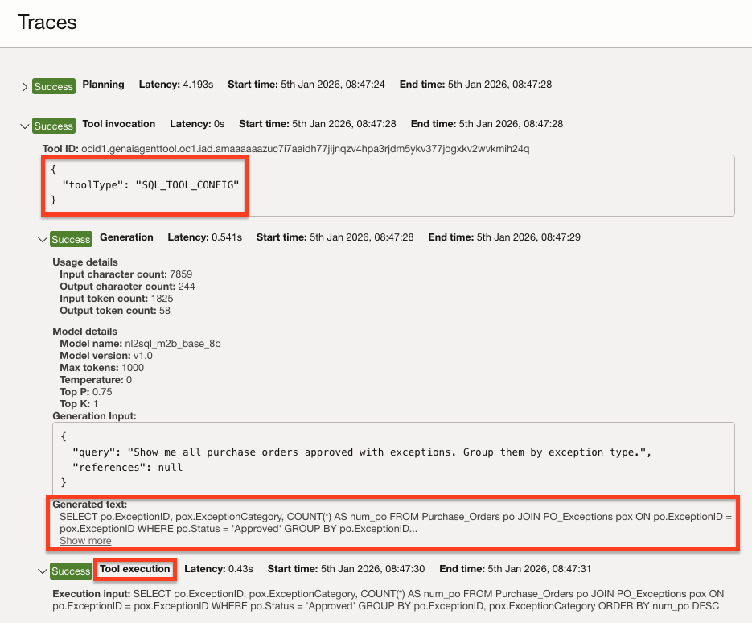
7. The third trace shows how the agent composed the final response using the output of the previous steps.
    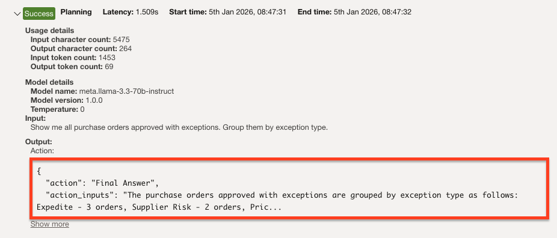
8. Click the **Close** button to close the traces pane.

9. Our next question would be:
   ```text
   <copy>
   Which suppliers have the most quality incidents? Include their current quality rating and contract status.
   </copy>
   ```
10. Click the **Submit** button.
    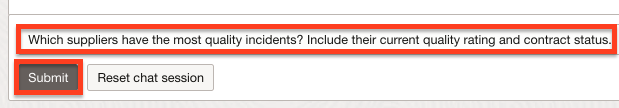
11. The agent shows that ValueMetal Manufacturing and Budget Parts Direct have the most quality incidents, and both are on Probation status. Using the power of Large Language Models (LLMs) and the configuration we've provided, the agent was able to identify the problematic suppliers and correlate them with their status.
    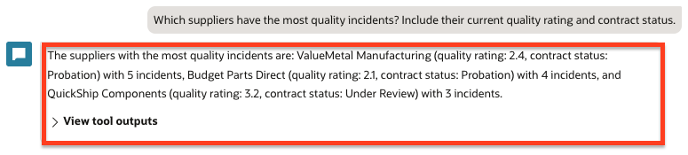
12. Feel free to take a look at the Traces generated for this response.

13. The agent remembers conversation context, so let's ask a follow-up question. Type:
    ```text
    <copy>
    What is the total production impact in hours from these suppliers?
    </copy>
    ```
14. Click the **Submit** button.
    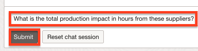
15. The agent understands "these suppliers" refers to the suppliers just mentioned and retrieves their total production impact hours from quality incidents. This demonstrates the agent's ability to maintain context across turns.
    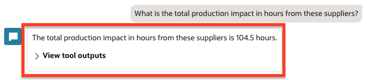
16. Next, let's look at spending. Type:
    ```text
    <copy>
    What is the TotalSpend for suppliers on Probation status? Are we still placing orders with them?
    </copy>
    ```
17. Click the **Submit** button.
    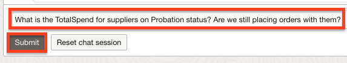
18. The agent returns the spend for probation suppliers ($1,430,000 total - ValueMetal Manufacturing $980,000 and Budget Parts Direct $450,000) and confirms we are still placing orders with them.
    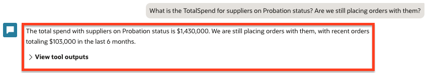
19. Now let's see if we can pull up a policy document. Type the following question:
    ```
    What does our policy say about placing orders with suppliers on probation?
    ```
20. Click the **Submit** button.
    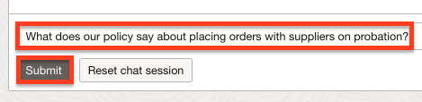
21. For this question, the agent figured out that the information required might be in the knowledge base documents. For this task it employed the RAG tool which searched for the relevant information in our procurement policy docs stored in object storage. Feel free to look at the traces for this interaction which show the steps the agent took to give us the information we needed. In the response you can see that a summary of the document was provided, and if you expand the **View citations** section, you'll be able to see a reference to the document(s) which were used to compose the reply with a direct link to the file(s), the page(s) from which content was extracted and more.
    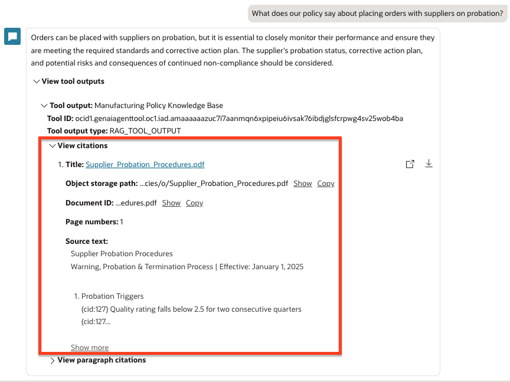
22. Now let's test the agent's ability to combine database queries with policy lookups. Type:
    ```text
    <copy>
    ValueMetal Manufacturing has 5 quality incidents and is on Probation. What does our supplier quality policy say should happen to them?
    </copy>
    ```
23. Click the **Submit** button.
    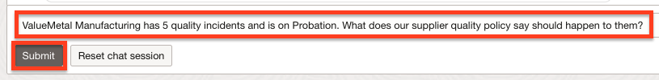
24. Watch the traces on the right — you'll see the agent:
    * Queries the database to confirm ValueMetal's incident count and status
    * Searches the Supplier Quality Standards and Supplier Probation Procedures documents
    * Explains what policy actions apply to this supplier based on their metrics
    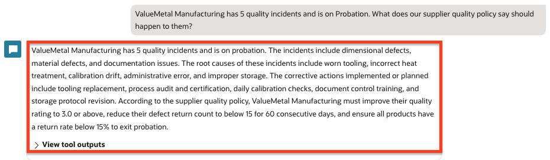
25. Let's explore regional patterns. Type:
    ```text
    <copy>
    Which region has the most expedite exceptions? Which regional facilities are driving this?
    </copy>
    ```
26. Click the **Submit** button.
    
27. The agent identifies the Southwest region as having the highest expedite exceptions and shows which facilities (Dallas, Phoenix) are generating them.
    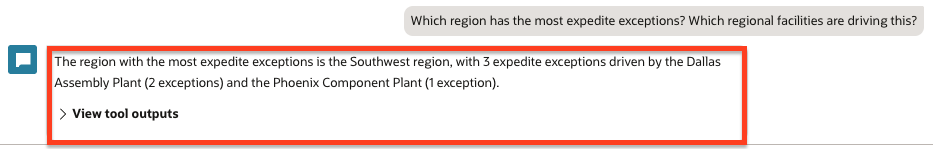
28. Now let's ask an executive question that requires analysis and recommendations. Type:
    ```text
    <copy>
    Our policy says suppliers below 3.0 rating should be reviewed. Who qualifies?
    </copy>
    ```
29. Click the **Submit** button.
    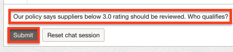
30. The agent checks the Suppliers table for those with QualityRating below 3.0 and may reference the Supplier Quality Standards policy. You should see ValueMetal Manufacturing (2.4) and Budget Parts Direct (2.1) — both already on Probation status.
    
    
    This is the kind of analysis that used to take weeks of workstreams — now delivered in seconds.

31. We invite you to try some prompts of your own to experiment with the agent.

---

## Task 3: (Optional) More prompts to try

Here are additional prompts that demonstrate different agent capabilities:

* Show me the trend of quality incidents by month.
* Which part categories have the highest spend variance from standard cost?
* Highlight suppliers where we have both high spend and high risk scores.
* Are there any sole-source suppliers with quality incidents?
* Which facilities have the most quality-related production downtime?
* Our policy says suppliers below 3.0 rating should be reviewed. Who qualifies?
* Are there any cases where we approved POs from probation suppliers without the required exception?
* Based on our quality incident patterns, which suppliers should we consider for probation?
* What would be the impact of moving away from our probation suppliers?
* Compare quality performance between Midwest and West region suppliers.
* How do our Assembly Plants compare to Component Plants in terms of PO exceptions?
* Which approver handles the most high-value exception approvals?

---

## Summary

As you've experienced, the OCI AI Agents service allows you to ask complex questions about data stored in multiple locations and get intelligent answers. By simply pointing the various tools towards your data sources and providing the right context, the agent was able to automatically determine which data source should be accessed, retrieve the data for you, compile a coherent and concise response and provide references to the original data when applicable.

Another interesting advantage of building solutions on top of the OCI AI Agents service is that the user is no longer restricted to tasks allowed by the application user interface. With a chat interface, the user can ask questions and get answers to any question which can be answered using the data in the system even if the system engineers did not plan for that specific scenario.

Although our use-case was focused on manufacturing procurement and supply chain operations, the OCI AI Agents service can be used to fuel many different use-cases which require deep understanding and retrieval of information from internal data sources, reasoning over the data, summarizing it, providing insights and more.

---

## Learn More

* [Chatting with Agents in Generative AI Agents](https://docs.oracle.com/iaas/Content/gen-ai-agents/chat-agent.htm)

## Acknowledgements

* **Author** - Taylor Zheng
* **Contributors** - Anthony Marino, Uma Kumar, Deion Locklear, Wynne Yang